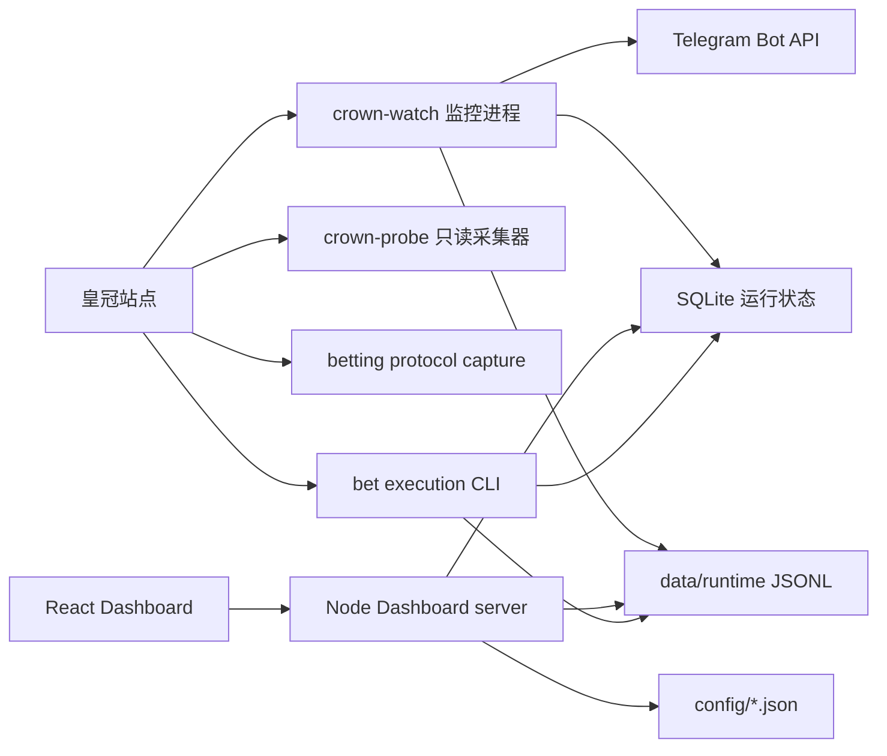
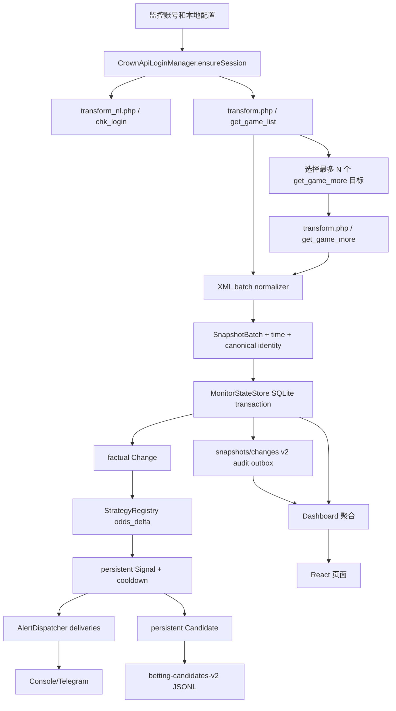
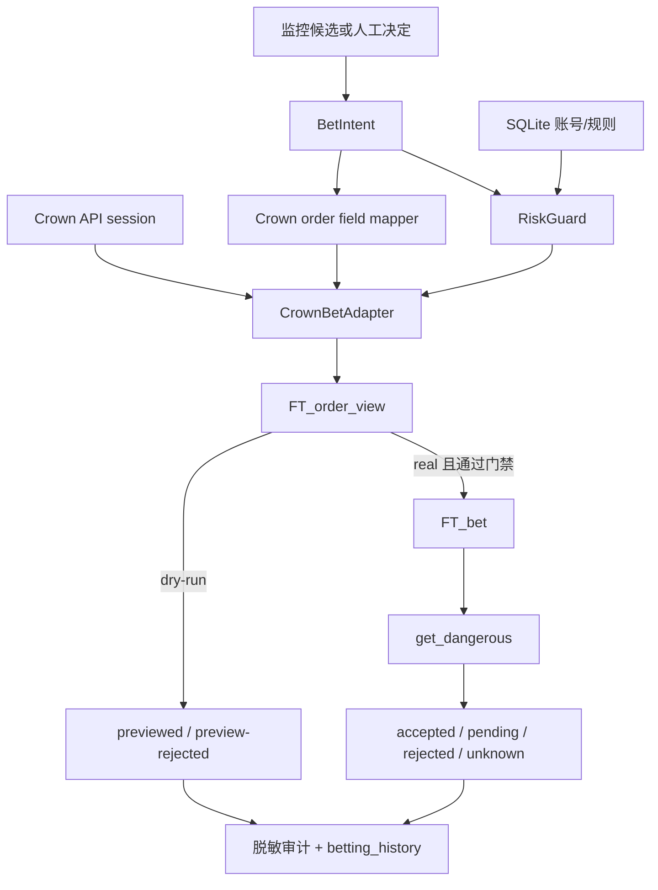

# 皇冠抓水投注：项目原理、代码架构与开发指南

## 2026-07-12 动态投注规则卡片当前权威契约

> 当前投注规则入口：`/betting-rules` 动态卡片。一个今日联赛只能属于一张现存卡片；卡片不区分赛前/滚球，执行 mode 来自 Signal。

- 监控报警继续使用彼此独立、可同时启用的 prematch/live 配置；投注卡片是 mode-agnostic，不保存 mode。
- 卡片 schema 为 `auto_betting_rule_cards` + `auto_betting_rule_card_leagues`。普通保存必须有名称、至少一个联赛、canonical 赔率区间和正整数 CNY 金额；`UNIQUE(league_name)` 是联赛独占的最终约束，停用卡片仍占用联赛。
- 今日联赛来自 Asia/Shanghai 当天 active 赛事与启用默认联赛的交集，再合并 exact event identity 命中的 active 手动追踪赛事。手动联赛只进入候选目录，必须在卡片中显式选择才可投注；当前卡片可保留自己的 stale 联赛。
- Signal、Telegram delivery、card inbox 与 cooldown 原子写入；卡片不可变快照进入 inbox/batch。执行 identity 包含 card、Signal mode、赛事、时段、market、盘口线和对面盘，B2 authorization 以 card scope 约束。
- 普通删除物理删除卡片并释放联赛，先在同一事务终结未绑定 batch 的 pending/retry/processing inbox；已创建 batch/child 和不可变历史快照不回读卡片，也不因编辑、停用或删除改变。
- “每日开工完全重置”保留现存卡片与联赛占用，清理 Signal、TG/inbox、card snapshot、batch/child、claim、锁、授权预算、submit/reconciliation/notification 等运行历史，并把真实投注保持为 off。
- Operations 使用 `ruleCards:{total,enabled,reviewRequired,ownedLeagues}`；不再以固定 prematch/live 投注设置判断 readiness。
- app/frontend/schema contract 统一为 `dynamic-betting-cards-v1`。当前 canonical Crown Preview/Submit/Reconciliation capability 为 `8/4/0`：八个全场 main 方向可 Preview，赛前全场 main 的让球 home/away、大小球 over/under 可 Submit；滚球 Submit 与 Reconciliation 继续关闭，真实 runtime 默认 off，仍需通过规则卡、账号、fresh Preview、lease/fence 和单次 Submit 门禁。
- 下方 C 阶段统一规则、固定投注设置和旧候选执行描述属于历史架构说明；与本节冲突时以本节、当前源码和测试为准。

## 2026-07-12 C 阶段历史状态（已被动态投注规则卡片契约覆盖）

- C Task 1–11 已完成；最终验证基线为 backend 874/874、syntax 180、frontend 66/66、production build 与 Compose config 通过。
- 统一监控/真实规则、单盘口一次、顺序多账号部分成交、rejected/unknown 终态、账号暂停排队、持久化全局意图和响应式运维控制台均已实现。
- canonical Crown capability matrix 在该历史阶段为 preview/submit/reconciliation `0/0/0`，所以当时真实 Crown 自动投注 fail-closed；当前 capability 以顶部 `8/4/0` 为准。
- 2026-07-12 已按用户确认清除历史赔率抓取和监控回放数据；投注账本、unknown/提交/对账表和协议证据永久保留。
- schema-v2 正常保存点击重置前的 snapshot/change JSONL；不会自动清理。运维控制台的“每日开工完全重置”会关闭真实投注、停启受管 watcher，并清除点击前的赔率/监控/投注运行状态、幂等锁、pending/unknown、对账、日志、索引、普通缓存和验收产物。账号凭据、登录会话、规则、Telegram、协议证据与运行依赖保留。
- Dashboard 启动时执行一次 schema/migration；运行时 API、状态刷新和 watcher 状态更新使用轻量 SQLite 连接，不再反复执行全库迁移检查。

## 历史：2026-07-11 B 阶段状态补充

- B1 Task 1–9、B2 Task 10–12 已完成代码实现与独立安全复核。
- 多账号账本、授权预算、durable submit attempt、unknown 恢复、持久对账证据和 Telegram outcome outbox 已实现；最终 backend 749/749、syntax 162、frontend 48/48、build/Compose config 通过。
- 当时 production Crown capability matrix 的 preview/submit 均为 0；真实提交、自动对账和人工 Crown 结果修正保持 fail-closed。旧 real CLI 已关闭，不是绕过入口；当前 capability 以顶部 `8/4/0` 为准。
- 尚未执行真实 Crown preview、`FT_bet`、真实 outcome Telegram 或历史诊断 cleanup。下一阶段为 C 正式设计与实施计划。
- B 阶段详细证据见 `.superpowers/sdd/task-12-report.md` 和 `.superpowers/sdd/progress.md`；本节及下文较早的“真实 CLI 已实现/资金对账未完成”等描述都属于历史状态，当前状态以文件顶部契约、当前源码和测试为准。

> 文档主体最初基于 2026-07-11 源码整理；顶部“动态投注规则卡片当前权威契约”的 capability 已按 2026-07-15 验收更新为 `8/4/0`。其余带日期的阶段内容只用于了解演进，不能替代顶部契约、当前代码和测试。

## 1. 文档目的

这份文档回答五个问题：

1. 项目解决什么问题，当前真正实现了什么。
2. 数据从皇冠进入系统后，怎样变成赔率、变化、提醒和投注候选。
3. 后端、SQLite、JSONL、React Dashboard 和投注模块怎样协作。
4. 新功能应该改哪些层、遵守哪些边界、怎样测试。
5. 当前有哪些未完成、已知风险或容易误解的地方。

阅读顺序建议：

- 只想知道系统能做什么：读第 2、3 节。
- 需要运行和维护：读第 4、11、12、15 节。
- 需要开发监控功能：读第 5、6、7、13 节。
- 需要开发 Dashboard：读第 9、10、13 节。
- 需要开发投注功能：读第 8、13、14 节。

## 2. 项目定位与当前边界

项目是一个本地运行的皇冠足球赔率监控与受控投注工具，包含四类能力：

| 能力 | 当前状态 | 说明 |
|---|---|---|
| 皇冠页面与 Network 探测 | 已实现 | Playwright 可见浏览器，只读采集 DOM、Network、截图和样本 |
| 足球赔率监控 | 已实现 | 默认 schema v2：SnapshotBatch + canonical identity + SQLite state；DOM 为 fallback/cross-check |
| 本地配置与可视化 | 已实现 | Node HTTP server + React + Ant Design + SQLite/JSON 配置 |
| 投注协议实验 | 已实现 | 可抓包、分类、脱敏、分析 `FT_order_view`、`FT_bet` 等阶段 |
| 投注 dry-run | 已实现并有测试 | 发送 `FT_order_view`，写脱敏审计与 SQLite 历史 |
| 受控真实投注 CLI | 代码已实现 | 需要显式 `--real`、确认词、限额和非 preview-only 规则 |
| 多账号顺序执行 | 代码已实现 | 按 `betOrder` 顺序执行，任一账号失败即停止 |
| Dashboard 真实投注控制 | 已实现，默认停止 | `/operations` 保存全局意图并仅在全部预检通过后受控启动 worker；当前 capability `8/4/0`，滚球 Submit 与 Reconciliation 关闭 |
| Signal 自动投注链 | 已实现但 fail-closed | watcher 不直接提交；Signal→card inbox→B2 必须经过动态卡片、授权、capability 和 lease/fence |
| 资金风控与订单对账 | B2 离线实现完成 | durable attempt、unknown 不重投、授权预算、恢复与对账证据已实现；真实 Crown 对账能力仍为 0 |

项目最重要的架构约束是：

> 监控链路与真实投注链路必须分离。监控命中后只能产生候选；任何真实提交必须进入独立执行入口，并经过显式授权、风险检查和审计。

## 3. 系统全景

### 3.1 技术栈

| 层 | 技术 |
|---|---|
| Runtime | Node.js ESM，要求 Node.js `>=22.5` |
| 浏览器采集 | Playwright 1.61，默认 Microsoft Edge channel |
| 本地数据库 | Node 内置 `node:sqlite` / SQLite WAL |
| HTTP 服务 | Node 内置 `node:http`，没有 Express/Koa |
| 前端 | React 18、TypeScript、Vite、Ant Design、Axios |
| 后端测试 | Node 内置 test runner：`node --test` |
| 前端测试 | Vitest + Testing Library + jsdom |
| 部署 | Docker 多阶段构建 + Docker Compose |
| 审计与赔率历史 | append-only JSONL |

根项目只有一个运行依赖性质的开发包 `playwright`。Dashboard 后端主要使用 Node 标准库，因此 Docker runtime 阶段几乎不需要第三方后端依赖。

### 3.2 顶层目录

| 路径 | 作用 | 是否属于源码 |
|---|---|---|
| `scripts/` | 所有 CLI 和长驻进程入口 | 是 |
| `src/crown/` | 皇冠专用实现 | 是 |
| `src/betting/` | 与 provider 无关的投注契约、风控、审计 | 是 |
| `frontend/src/` | React Dashboard | 是 |
| `tests/` | Node 后端与 CLI 测试 | 是 |
| `config/` | 联赛、监控、提醒和 Telegram 本地配置 | 配置 |
| `docs/` | 架构、协议、模块、计划和项目记忆 | 文档 |
| `data/fixtures/` | 可提交的固定离线样本 | 测试资料 |
| `data/runtime/` | session、赔率、候选、审计、诊断 | 本地运行数据，不应提交 |
| `data/crown-profile/` | Playwright 持久化浏览器 profile | 本地敏感数据 |
| `storage/` | SQLite、密钥和备份 | 本地敏感数据 |
| `output/`、`logs/` | 验证截图、分析和运行日志 | 生成物 |

### 3.3 进程模型

系统没有一个包办所有工作的单体进程，而是多个入口共享模块与本地文件：



各进程职责：

| 入口 | 长驻 | 可写内容 | 是否可能真实下注 |
|---|---:|---|---:|
| `scripts/crown-probe.mjs` | 交互式 | probe capture | 否 |
| `scripts/crown-watch.mjs` | 是 | 赔率、变化、候选、runtime log、SQLite 状态 | 否 |
| `scripts/crown-dashboard.mjs` | 是 | SQLite、JSON 配置；可启停本机 watcher 子进程 | 否 |
| `scripts/crown-betting-protocol-capture.mjs` | 交互式 | private/public 抓包 | 显式开启后可能 |
| `scripts/crown-bet-execute.mjs` | 否 | 审计、历史 | 显式开启后可能 |
| `scripts/crown-bet-execute-sequence.mjs` | 否 | 审计、历史 | 显式开启后可能 |
| `scripts/crown-betting-candidate-dry-run.mjs` | 否 | 审计、历史 | 否，只允许 preview |

## 4. 从启动到页面展示的完整流程

### 4.1 常见本机启动

1. `npm install` 安装根依赖。
2. `npm --prefix frontend install` 安装前端依赖。
3. `npm --prefix frontend run build` 生成 `frontend/dist/`。
4. `npm run crown:dashboard` 启动本地 Dashboard。
5. 在 Dashboard 保存皇冠监控账号、默认联赛和监控规则。
6. 点击“开始监控”，或手工运行 `npm run crown:watch -- --monitor-state-version 2`。
7. watcher 获取 XML，把 list/detail 封装为 authoritative/partial SnapshotBatch，在 SQLite 事务中更新事实状态。
8. Change 经 StrategyEngine 生成持久 Signal；Dispatcher/候选分别消费 Signal，v2 JSONL 只承担追加审计与导出。
9. Dashboard 读取 v2 JSONL generation，并用 SQLite 聚合监控健康。

### 4.2 主数据流



### 4.3 数据源优先级

运行时有三类来源：

1. `XML live`：真实 `transform.php` XML，是主源。
2. `DOM legacy/cross-check`：浏览器页面提取，只在显式 schema-v1 回滚或离线交叉检查使用；默认 v2 不会静默降级。
3. `fixture replay`：当 runtime snapshot 不存在或为空时，Dashboard 使用固定 fixture。

`src/crown/dashboard/dashboard-data.mjs` 会：

- 检查 `crown-odds-snapshots-v2.jsonl` 和 `crown-odds-changes-v2.jsonl`；任一存在就选择整个 v2 generation。
- v2 文件存在但为空/局部缺失时不退回 v1，也不把 v1 event lifecycle 计数混入健康。
- 只有 v2 文件均不存在时，才读取 schema-v1 runtime；runtime 也不存在时才使用 fixture。
- 读取最近 runtime log，并以有界 aggregate SQL 查询 SQLite v2 health。
- 只读取 JSONL 尾部或流式过滤，避免每次加载整个大文件。

## 5. 探测、登录与会话

### 5.1 只读 Probe

入口：`scripts/crown-probe.mjs`。

Probe 使用 Playwright persistent context 打开皇冠页面，用户手动登录和切换页面。它记录：

| 输出 | 内容 |
|---|---|
| `network.jsonl` | 请求/响应元数据，敏感 header 和参数已脱敏 |
| `network-summary.json` | Network 汇总 |
| `json-responses/*.json` | 符合采集条件的 JSON 样本 |
| `dom-candidates.json` | 可能含盘口的 DOM 节点 |
| `dom-containers.json` | 赛事容器候选 |
| `dom-events.json` | 解析后的原始赛事卡 |
| `football-today-filtered.json` | 过滤后的赛前/滚球足球赛事 |
| `page-text.txt`、`page.png` | 页面文本和截图 |

Probe 的关键设计：

- 默认可见浏览器，便于人工登录。
- 只读，不点击盘口、不填金额、不提交订单。
- `--from-capture` 可对已有采集重新后处理，不访问网络。
- `--save-html` 可能保存敏感页面内容，默认关闭。
- Network 采集逻辑和 DOM 解析逻辑目前集中在一个较大的入口文件中。

### 5.2 Endpoint 分析

入口：`scripts/crown-analyze-network.mjs`。

分析器会：

- 去掉 URL 中动态 query key，聚合同类 endpoint。
- 收集 JSON shape、足球字段、赔率字段、live/prematch 信号。
- 对候选 endpoint 评分和分类。
- 生成 `endpoint-candidates.json` 和 `endpoint-candidates.md`。

已确认结论：`/gismo/*` 当前样本主要是比赛资料、统计、时间线和翻译，不是皇冠真实赔率主源。

### 5.3 API 登录主路径

主要代码：`src/crown/login/crown-api-login-manager.mjs`。

核心类：

| 类 | 职责 |
|---|---|
| `CrownApiClient` | 发 `transform_nl.php`/`transform.php` form POST |
| `CrownApiSessionStore` | 读写 `api-session.json` |
| `CrownApiLoginManager` | 缓存会话验证、重新登录、诊断和统一结果 |

`ensureSession()` 的顺序：

1. 从 `data/runtime/crown-sessions/<accountId>/api-session.json` 读取缓存。
2. 用缓存调用 `get_game_list` 验证。
3. 验证成功则更新 cookies/savedAt 并继续复用。
4. 验证为登录失效时删除缓存。
5. 调用 `transform_nl.php`，提交 `p=chk_login`、用户名和密码。
6. 从 XML 解析 `uid`，同时收集 `Set-Cookie`。
7. 再调用 `get_game_list` 完成会话验证。
8. 保存新会话。

`CrownApiClient.fetchGameList()` 使用的主要字段：

- `p=get_game_list`
- `gtype=ft`
- `showtype=today`
- `rtype=r`
- `ltype=3`
- `filter=MIX`

`fetchGameMore()` 使用 `lid`、`ecid`、`showtype`、`isRB` 等字段获取详细盘口。

账号保存的 public HTTPS exact origin 是该账号登录、只读检测、game-more、Preview 与 Submit 的唯一授权地址，不再叠加静态 membership whitelist。账号地址必须无 credentials/path/query/hash，并拒绝 HTTP、localhost、private hostname 与 IP literal；请求采用 manual redirect，任何跨 origin redirect 都在使用响应或 cookie 前 fail-closed。

API 会话文件包含认证材料，只能留在忽略的本地 runtime 目录，不能进入文档或版本库。

### 5.4 浏览器登录 fallback

主要代码：

- `src/crown/login/crown-login-manager.mjs`
- `src/crown/login/crown-cookie-store.mjs`
- `src/crown/login/crown-session-detector.mjs`
- `src/crown/login/crown-login-diagnostics.mjs`

当没有可用的 API 账号密码时，watcher 会启动 Playwright：

1. 加载 cookies/storageState。
2. 检查当前页面是否已登录。
3. 无有效 session 时寻找账号、密码和登录按钮 selector。
4. 遇到 CAPTCHA、滑块、OTP、MFA、短信等提示时进入人工处理状态，不绕过验证。
5. 登录失败时只保存安全诊断摘要，不保存页面截图、cookies、storageState、密码或 input value。

状态识别覆盖：已登录、登录失效、Welcome 页面、需要人工验证、网络异常、XML 无响应等。

诊断目录：`data/runtime/login-diagnostics/<timestamp>-<accountId>/`。

当前诊断实现只写 schema-v2 安全摘要；写入前统一脱敏，`readLoginDiagnostics()` 还会在读取旧 snapshot 时再次脱敏，Dashboard API 不返回 cookies、storageState、账号密码、header、token、input value 或页面像素。历史目录可能仍包含旧版本生成的敏感文件，因此提供 `npm run crown:login-diagnostics:cleanup` 只读预检；真正改写/删除必须由用户明确授权后增加 `--apply`。仓库未自动清理用户历史 runtime，完成清理后还应轮换相关密码并使旧 session/cookie 失效。

### 5.5 Watcher 的登录选择

`scripts/crown-watch.mjs` 的 `runLiveWatch()` 会从 SQLite 读取一个启用的监控账号：

- 有用户名和解密后的密码：直接进入 `runDirectApiWatch()`，不打开浏览器。
- 默认 v2 没有完整可用账号密码：fail-closed 并给出明确错误，不启动浏览器。只有显式 schema-v1 回滚才启动 browser/DOM，并依赖已有 profile/session。
- `--login-test`：验证登录、保存 `LoginResult` 后退出，不进入长驻监控。

需要注意：当前并没有“API 登录失败后自动切到浏览器”的分支。API 账号存在时，API 登录失败会结束/失败当前主链；浏览器登录管理器虽已实现，但不是 API 失败后的自动 fallback。API 主链也没有应用 browser session manager 的最多 3 次自动重登上限，它会在后续 poll 继续尝试 session/login。

## 6. 赔率识别、标准化和过滤

### 6.1 Endpoint Detector

文件：`src/crown/endpoint-detector.mjs`。

它把输入分为：

| kind | 说明 |
|---|---|
| `crown-transform-xml` | 高置信皇冠 XML 赔率 |
| `dom-football-fixture` | DOM fixture 数据 |
| `football-metadata` | gismo 足球元数据，不产生赔率 |
| `football-odds-candidate` | 低置信关键词候选 |
| `irrelevant` / `unknown` | 排除或未知 |

检测器不负责生成标准赔率；它只决定后续由哪个 normalizer 处理。

### 6.2 XML Normalizer

文件：`src/crown/crown-transform-xml.mjs`。

处理步骤：

1. 分类响应是赔率 XML、空响应、登录失效 HTML 还是非法 XML。
2. 提取 `<game>` 字段。
3. 用皇冠 ID 组合稳定 `eventKey`。
4. 遍历已声明的让球和大小球 field spec。
5. 为主线、上半场和 A-F 分线生成独立 `lineKey`。
6. 生成本地 `marketKey` 和 `selectionKey`。
7. 对关闭或缺少有效赔率的 selection 标记 `suspended=true`。

当前会采集：

- 全场/上半场让球。
- 全场/上半场大小球。
- 赛前和滚球字段。
- A-F alternate lines。

当前不会进入新快照的市场：独赢、单双、是否、球队大小球以及其他未知市场。

重要字段：

| 类型 | 示例 |
|---|---|
| 皇冠赛事 ID | `GID`、`GIDM`、`HGID`、`ECID`、`LID` |
| 让球 line | `RATIO_R`、`RATIO_RE`、`RATIO_HR`、`RATIO_HRE` |
| 让球 odds | `IOR_RH`、`IOR_RC`、`IOR_REH`、`IOR_REC` |
| 大小 line | `RATIO_OUO`、`RATIO_ROUO`、`RATIO_HOUO`、`RATIO_HROUO` |
| 大小 odds | `IOR_OUC`、`IOR_OUH`、`IOR_ROUC`、`IOR_ROUH` |

### 6.3 DOM Normalizer

文件：

- `src/crown/dom-football-extractor.mjs`
- `src/crown/normalize-football.mjs`

DOM normalizer 从页面文本识别“让球”和“大/小”，生成与 XML 形状一致的记录，但它有明显局限：

- ID 来自 DOM 和本地组合，不是 provider order ID。
- `ratioField`、`oddsField` 和 `oddsId` 通常不可用。
- 盘口值主要靠文本规则推断。
- warnings 会包含 `inferred-dom-market`、`local-market-id` 等。

因此 DOM 记录适合健康检查和显示，不适合直接构造投注请求。

### 6.4 标准化记录结构

校验入口：`src/crown/schema/normalized-odds.schema.mjs`。

简化结构：

```json
{
  "provider": "crown",
  "sport": "football",
  "mode": "prematch | live | odds-refresh | unknown",
  "capturedAt": "ISO-8601",
  "source": {
    "endpointKey": "POST .../transform.php",
    "mapperVersion": "crown-transform-xml-v2"
  },
  "event": {
    "eventId": "provider-related id",
    "eventKey": "stable local key",
    "league": "...",
    "homeTeam": "...",
    "awayTeam": "...",
    "status": "not_started | live | suspended | unknown",
    "ids": { "gid": "...", "ecid": "...", "lid": "..." }
  },
  "market": {
    "marketId": "local composite key",
    "marketKey": "local composite key",
    "idScope": "local",
    "marketType": "asian_handicap | total",
    "period": "full_time | first_half",
    "handicapRaw": "0/0.5",
    "ratioField": "RATIO_RE",
    "lineKey": "RATIO_RE"
  },
  "selection": {
    "selectionId": "local composite key",
    "selectionKey": "local composite key",
    "idScope": "local",
    "oddsId": null,
    "side": "home | away | over | under",
    "oddsRaw": "0.83",
    "odds": 0.83,
    "oddsField": "IOR_REH",
    "suspended": false
  },
  "warnings": []
}
```

不要误解：

- `marketId`、`selectionId` 当前多数是本地组合 key。
- `oddsId` 没有从现有 XML 样本确认，保持 `null`。
- 投注字段必须经过 `crown-order-field-mapper.mjs` 的白名单映射，不能把本地 ID 直接提交给皇冠。

### 6.5 两套联赛配置的区别

项目有两套容易混淆的联赛配置：

| 配置 | 匹配方式 | 主要用途 |
|---|---|---|
| `config/monitored-leagues.json` | exact/contains/regex，可带 aliases 和 exclude | 采集过滤、排除电竞/虚拟赛事、统计 kept/dropped |
| `config/default-leagues.json` | 当前只按 `name` 精确匹配 | 决定哪些联赛可以触发提醒；手动追踪比赛可越过它 |

watcher 的保存规则不是“只保存 include 联赛”：

- 被 `exclude` 明确命中的记录不会写 Dashboard snapshot。
- 未命中 include、但也未被明确 exclude 的真实足球记录仍可写入 snapshot，供 Dashboard 选择。
- 是否触发提醒由 `default-leagues` 或 SQLite 中 active 的手动追踪比赛进一步决定。

这种分层使“可见比赛范围”和“允许报警范围”分开。

## 7. 快照、变化、监控规则、提醒与候选

### 7.1 schema-v2 默认状态链

默认 `--monitor-state-version 2` 的 direct XML 链路由以下模块组成：

| 层 | 模块 | 职责 |
|---|---|---|
| 批次 | `snapshot-batch.mjs` | list=authoritative，detail=partial；拒绝不完整/登录失效批次 |
| 当前状态 | `monitor-state-store.mjs` | SQLite 事务更新 scope/event/selection，计算纯事实 Change |
| 策略 | `strategy-registry.mjs`、`odds-delta-strategy.mjs` | 读取兼容转换后的规则，缺必需数据 fail-closed |
| 信号 | `signal.mjs` | 按策略版本、selection、Change 和阈值生成确定性 Signal |
| 投递 | `alert-dispatcher.mjs` | 独立 claim/retry/timeout/dead-letter，不阻塞采集循环 |
| 候选 | `monitor-bet-signal.mjs` + candidate store | 只消费 Signal，candidateId 确定性且重放去重 |

首次 authoritative/detail 只建 baseline，不产生 odds Signal。JSONL 由 SQLite audit outbox 事务后导出；重启恢复读取 SQLite，而不是扫描旧 snapshot 尾部。

Change 与业务副作用的边界是：

```text
MonitorStateStore → Change(fact only)
Change + Strategy rule → Signal(persistent decision)
Signal → Delivery queue / Candidate
Candidate → independent dry-run or execution module
```

StateStore 不读取监控设置，不在 Change 上写 `candidate=true/false`。Dispatcher 失败不删除 Signal；Candidate Builder 不读取 raw Change；watcher 不调用真实投注 adapter。

### 7.2 schema-v1 legacy JSONL Store

文件：`src/crown/storage/jsonl-store.mjs`。

`JsonlOddsStore` 做三件事：

1. 只保留 `asian_handicap` 和 `total`。
2. 追加写 snapshots。
3. 用内存中最新状态生成 changes，再追加写 changes。

稳定身份键由 provider、event、period、marketType、lineKey、side 组成。`lineKey` 很重要：它避免 A-F 分线或同场不同盘口相互覆盖，也让反向 selection 查找保持在同一条 line 上。

变化类型：

| type | 触发条件 |
|---|---|
| `odds-change` | 同一 identity 的 oddsRaw 改变，且新 selection 未 suspended |
| `handicap-change` | handicapRaw 改变 |
| `market-suspended` | 从可用变为 suspended |
| `market-reopened` | 从 suspended 恢复 |
| `event-added` | 新批次出现以前不存在的 event |
| `event-removed` | 以前 active 的 event 不在当前批次 |

JSONL 是 append-only；不会原地更新，也不会自动压缩。启动时默认最多从 snapshot 尾部预加载 64 MiB 恢复最新状态，可用 `CROWN_STORE_PRELOAD_BYTES` 调整。

这是只供 `--monitor-state-version 1` 回滚、DOM 和 fixture 兼容的 legacy 链路。它把 `get_game_list` 和每个 `get_game_more` 都当成“当前完整赛事集合”，会制造 event added/removed 抖动并删除其他赛事 baseline。旧文件保留为污染历史证据，但不能并入 v2 健康或恢复。

### 7.3 监控设置与 Strategy 兼容迁移

文件：`src/crown/monitor/monitor-settings.mjs`。

以下 `runningMode` 内容属于旧 schema-v1/C 阶段兼容说明；当前 monitor prematch/live 可独立启用并由同一 watcher 处理：

- `handicap`：赛前/指定 period 的水位变化监控。
- `live`：滚球分钟区间监控。

启动一个模式会关闭另一个模式，并写入“因另一个模式启动而关闭”。

通用判断顺序：

1. 当前模式是否启用。
2. 联赛是否命中默认白名单，或比赛是否已被手动追踪。
3. prematch/live mode 是否符合。
4. 赛前开赛时间窗口或滚球分钟是否符合。
5. 新赔率是否在 min/max 范围。
6. 变化方向是否符合 up/down/both。
7. 绝对变化是否达到 `waterMoveThreshold`。
8. selection cooldown 是否结束。

schema-v2 将现有 handicap/live 配置转换为带 id/version 的 `odds_delta` 策略。Crown 独立时间解析器生成 start time/live clock；缺数据时返回明确的 `data_incomplete`，不会绕过时间门禁。

### 7.4 Console、Telegram 与 Dispatcher

主要文件：

- `src/crown/alerts/console-alert.mjs`
- `src/crown/alerts/telegram-alert.mjs`
- `src/crown/alerts/telegram-templates.mjs`
- `src/crown/telegram/telegram-client.mjs`
- `src/crown/config/telegram-settings.mjs`

Telegram 支持：

- 多个 Chat ID。
- `chatId:threadId` 格式的 forum topic。
- 通过 `getUpdates` 获取 Chat ID。
- `HTML` parse mode。
- 分开的 `oddsAlert` 与 `betSuccess` bot 配置。
- API 返回 masked token 状态，不返回明文 token。

schema-v2 sender 只接收持久 Signal。每个渠道在 `monitor_deliveries` 独立记录 pending/retry/sent/dead-letter；网络等待有 timeout，不阻塞下一轮 XML 采集。B2 outcome notification outbox 与 Telegram consumer 已接线；在该历史验收轮次，真实 submit/reconciliation capability 当时为 0，因此没有真实投注结果可发送。当前 capability 以文件顶部 `8/4/0` 为准。

### 7.5 从 Signal 生成投注候选

文件：`src/crown/betting/monitor-bet-signal.mjs`。

只有持久 Signal 才生成 v2 候选。方向逻辑：

| `betDirectionMode` | 行为 |
|---|---|
| `follow` | 始终选择原 selection |
| `reverse` | 始终选择相反 selection |
| `auto` + 水位上涨 | 选择相反 selection |
| `auto` + 水位下降 | 选择原 selection |

反向关系：home ↔ away，over ↔ under。

反向查找使用相同 event、period、marketType 和 lineKey，避免拿到同场另一条盘口。

候选可能是：

- `eligible`：有目标 selection、未封盘、赔率存在且不低于下注规则下限。
- `skipped`：记录明确的 `skipReason`，例如规则未启用、找不到反向盘口、目标封盘或赔率太低。

默认输出：`data/runtime/betting-candidates-v2.jsonl`。候选先写 `monitor_candidates`，再由 outbox 导出，Signal 重放不会重复写入。

schema-v1 rollback 继续写 `betting-candidates.jsonl`。关键边界不变：watcher 只写候选，不调用 `CrownBetAdapter`。

## 8. 投注协议与执行架构

### 8.1 分层



代码边界：

| 路径 | 职责 |
|---|---|
| `src/betting/` | provider 无关的 intent、risk、audit |
| `src/crown/betting-protocol/` | 抓包、脱敏、阶段分类、存储 |
| `src/crown/betting/` | Crown 字段映射、响应解析、adapter |
| `scripts/crown-bet-*.mjs` | CLI orchestration |

### 8.2 协议抓包

入口：`scripts/crown-betting-protocol-capture.mjs`。

流程：

1. 打开可见 persistent browser。
2. 安装 request/response recorder。
3. 安装 submit request blocker。
4. 用户手工登录、打开比赛、点击赔率、填写小额 stake。
5. 未开启 real submit 时，分类为 submit 的请求在网络层 abort。
6. 同时写 private raw capture 和 public redacted capture。

抓包目录：

```text
data/runtime/betting-protocol-captures/<run>/
├─ private/raw-network.jsonl
└─ public/
   ├─ redacted-network.jsonl
   └─ manifest.json
```

`private/` 可能包含 cookies、uid、ticket 等认证材料，只能留在本机。

阶段分类器 `protocol-classifier.mjs` 将请求分为 monitor、preview、submit、candidate、unknown。`FT_bet` 会被识别为 submit；默认 `allowRealSubmit=false` 时被阻止。

### 8.3 BetIntent

文件：`src/betting/bet-intent.mjs`。

`normalizeBetIntent()` 统一人工操作、bootstrap 和监控候选的输入，强制：

- provider 必须是 `crown`。
- sport 必须是 `football`。
- 必须有 event ID、oddsRaw 和 maxStakeHint。
- 市场、selection、来源信息整理成稳定结构。

Intent 是“想下什么”，不是“已经允许提交什么”。

### 8.4 Crown 字段映射

文件：`src/crown/betting/crown-order-field-mapper.mjs`。

Mapper 使用明确白名单把标准记录转换成：

- preview：`gid`、`gtype`、`wtype`、`chose_team`。
- submit：增加 `golds`、`rtype`、`ioratio`、`con`、`isRB`、`f` 等。

它支持的逻辑形态包括全场/上半场、让球/大小、赛前/滚球的已声明字段组合；未被白名单识别的 ratioField/oddsField 会抛出 `unsupported-crown-market`。A-F alternate-line 字段目前不会自动进入执行映射。

注意：`crown-bet-bootstrap.mjs` 自动选择的范围更窄，只选择已有 live 证据的：

- live `RATIO_RE` 全场让球。
- live `RATIO_HROU*` 上半场大小球。

### 8.5 风控

文件：`src/betting/risk-guard.mjs`。

当前检查：

- 投注账号必须 `enabled`。
- 投注规则必须 `enabled`。
- real 模式下规则必须 `previewOnly=false`。
- stake 必须为正数。
- stake 不得超过单笔规则限额。
- stake 不得超过 intent 的 `maxStakeHint`。
- stake 不得超过规则/账号配置的限额字段。
- odds 必须在规则 min/max 范围。

CLI 还有独立真实提交门禁：

- 必须显式 `--real`。
- 必须 `--confirm REAL_BET`。
- 必须提供 `--max-stake`。
- 代码硬限制 `max-stake <= 50`。
- 本次 stake 不得超过 `max-stake`。

该门禁已修复：无论 stake 来自显式 `--stake` 还是 intent 的 `maxStakeHint`，都会在 session、数据库、登录和 Provider 调用前计算 effective stake，并强制 `0 < stake <= maxStake <= 50`；`--max-stake 0` 会被拒绝。

### 8.6 CrownBetAdapter

文件：`src/crown/betting/crown-bet-adapter.mjs`。

`execute()` 顺序：

1. `evaluateRisk()`。
2. 请求 `FT_order_view`。
3. preview 失败则返回 `preview-rejected`。
4. dry-run 到此结束，成功为 `previewed`。
5. real 模式再次检查 `allowRealSubmit` 和确认词。
6. 请求 `FT_bet`。
7. submit 失败为 `submit-rejected`。
8. submit 成功后调用一次 `get_dangerous`。
9. 返回 accepted/pending/rejected/unknown。
10. 写脱敏 audit 和 SQLite betting_history。

响应解析器不会枚举输出原始 `ticketSecret`；审计还会递归脱敏 uid、cookie、token、password、ticket 等字段。

### 8.7 执行入口

| 入口 | 用途 |
|---|---|
| `crown:betting:bootstrap` | 创建本机 preview-only 账号/规则，并从最新支持快照生成 intent |
| `crown:betting:execute` | 指定一个 account 和 rule 执行 dry-run 或受控 real |
| `crown:betting:execute-sequence` | 按账号 `betOrder` 顺序执行 |
| `crown:betting:candidate-dry-run` | 消费 eligible 候选，刷新最新盘口并只 preview |

候选 dry-run 默认拒绝超过 180 秒的候选。它会先从 snapshot 中按相同 event/period/market/line/side 刷新目标，减少旧盘口导致 `code=555` 的概率。

单账号 `crown:betting:execute` 还有账号归属风险：`--account-id` 选择的是用于风控和 history 归属的投注账号，但实际 Crown session 默认读取 `data/runtime/crown-sessions/mon_primary/api-session.json`，除非另传 `--session-account-id`。因此可能用监控账号提交，却把结果记在另一个投注账号下。多账号 sequence 不存在这一特定错配，因为它会为每个投注账号用自己的用户名、密码和网址建立 session。

顺序执行只读取：

- `status=enabled`
- `bet_order>0`
- 已保存密码

的账号，排序为 `bet_order ASC, created_at ASC, label ASC`。dry-run 要求每个账号返回 `previewed` 才继续；real 要求每个账号返回 `accepted` 才继续。

### 8.8 执行状态

| 状态 | 含义 |
|---|---|
| `blocked` | 风控或 real 门禁未通过 |
| `previewed` | `FT_order_view` 返回赔率和限额，未提交真实订单 |
| `preview-rejected` | 开单预览失败，例如 `code=555` 且无赔率/限额 |
| `submit-rejected` | `FT_bet` 返回失败 |
| `accepted` | `get_dangerous` 观察到接受状态 |
| `pending` | 状态仍待定 |
| `rejected` | 状态确认拒绝 |
| `unknown` | 响应无法归类 |
| `login-or-execution-failed` | 顺序执行中登录或执行抛错 |

## 9. Dashboard 后端、数据持久化与 API

### 9.1 服务入口

`scripts/crown-dashboard.mjs`：

1. 读取项目 `.env`，但不覆盖已经存在的环境变量。
2. 创建 `MonitorProcessController`。
3. 启动 `src/crown/dashboard/static-server.mjs`。
4. 默认监听 `127.0.0.1:8787`。

`static-server.mjs` 同时处理：

- `/api/*` JSON API。
- `frontend/dist` 静态文件。
- 已声明 React route 的 `index.html` fallback。
- 路径 traversal 防护。

请求 body 最大 1 MiB。API 响应均设置 `cache-control: no-store`。

### 9.2 持久化分工

| 数据 | 存储 | 原因 |
|---|---|---|
| v2 当前监控状态 | SQLite | scope/event/selection checkpoint，重启可恢复 |
| 赔率快照/变化 | JSONL | append-only、可回放、可审计；不承担 v2 当前状态 |
| Signal/冷却/投递/候选 outbox | SQLite | 幂等、跨重启恢复、渠道状态独立 |
| watcher runtime 统计/错误 | JSONL | 长驻进程顺序日志 |
| 投注候选/执行审计 | JSONL | 独立于 UI，可追溯 |
| 监控账号/投注账号/规则/历史 | SQLite | CRUD、排序、状态更新 |
| 默认联赛/监控设置/Telegram | JSON | 直接可编辑、便于 watcher 热加载 |
| API/browser session | runtime JSON | 本地复用，不能提交 |
| 密钥 | 本地 key file 或环境变量 | 与数据库分开 |

### 9.3 SQLite Schema

文件：`src/crown/app/app-db.mjs`。

数据库默认：`storage/crown.sqlite`，启用 foreign keys 和 WAL。打开数据库时自动建表、补列 migration，并执行少量旧 dry-run 名称迁移。

| 表 | 主要字段 | 作用 |
|---|---|---|
| `tracked_matches` | event、league、teams、mode、tracking_status | 手动追踪比赛 |
| `monitor_accounts` | username、login_url、encrypted secret、login/runtime 状态 | 单个主监控账号及运行状态 |
| `monitor_rules` | filters、min change、poll、alert | 旧/通用监控规则 CRUD |
| `auto_betting_rule_cards` | name、enabled、odds TEXT、amount、eligibility、version | 当前动态投注卡片 |
| `auto_betting_rule_card_leagues` | card_id、唯一 league_name | 当前卡片联赛独占 |
| `betting_rules` | amount limits、odds range、direction、preview_only | 历史 B/C 规则证据；不再是当前规则入口 |
| `betting_accounts` | username、website、bet_order、status、encrypted secret | 投注账号与顺序 |
| `betting_history` | account、event、rule、status、amount、details_json | preview/submit/结果摘要 |
| `monitor_scope_state` | scope、last batch/complete、event set | v2 权威批次 checkpoint |
| `monitor_event_state` | canonical event、active/missing、provider IDs | v2 赛事生命周期 |
| `monitor_selection_state` | selection identity、captured time、snapshot | v2 最新盘口 baseline |
| `monitor_signals` | deterministic id/key、strategy、expiry、payload | 持久业务信号 |
| `monitor_cooldowns` | signal key、expiry | 跨重启策略冷却 |
| `monitor_deliveries` | signal/channel、status、attempts、next attempt | 异步投递队列 |
| `monitor_audit_outbox` | fact id/kind、batch、status、payload | v2 JSONL 事务后导出 |
| `monitor_candidates` | candidate/signal、status、export status | 确定性候选和 sidecar 导出 |

Repository：`src/crown/app/app-repository.mjs`。

它负责：

- SQL 与前端 camelCase 对象互转。
- 输入交给 `app-validation.mjs` 归一化。
- secret 加密保存、API 输出脱敏。
- 单主监控账号 `mon_primary` 语义。
- 投注账号按 `betOrder` 排序。
- 执行专用查询只返回可执行账号，并在进程内解密密码。

### 9.4 Secret 处理

文件：`src/crown/app/app-secret.mjs`。

- 算法：AES-256-GCM。
- ciphertext 格式：`v1:<iv>:<tag>:<encrypted>`。
- `CROWN_SECRET_KEY` 优先作为主密钥材料。
- 未提供环境变量时，自动创建 `storage/crown-local-secret.key`。
- 可用 `CROWN_LOCAL_SECRET_KEY_PATH`/`CROWN_SECRET_KEY_FILE` 指定文件。
- API 不返回密文或明文，只返回 `hasSecret`。

SQLite 与 key file 必须一起保护。只复制 SQLite、不复制对应 key，已保存密码无法解密。

### 9.5 API 清单

赔率只读 API：

| Method | Path | 作用 |
|---|---|---|
| GET | `/api/health` | 服务健康信息 |
| GET | `/api/config` | monitored leagues 配置状态 |
| GET | `/api/summary` | 数据源和赛事/记录汇总 |
| GET | `/api/events` | 聚合后的当前赛事 |
| GET | `/api/changes?limit=&eventKey=` | 最近变化或单场完整变化 |

本地 JSON 配置 API：

| Method | Path | 作用 |
|---|---|---|
| GET | `/api/matches/leagues` | 当前联赛聚合、追踪和默认联赛状态 |
| POST | `/api/matches/leagues/track` | 追踪一个联赛内当前所有比赛 |
| POST | `/api/matches/leagues/untrack` | 取消联赛内 active 追踪 |
| GET/PUT | `/api/default-leagues` | 读取/保存默认联赛 |
| GET/PUT | `/api/monitor-settings` | 读取/保存监控设置 |
| POST | `/api/monitor/start` | 启用一个监控模式 |
| POST | `/api/monitor/stop` | 停止一个监控模式 |
| GET/PUT | `/api/settings/telegram` | masked 读取/合并保存 Telegram 设置 |
| POST | `/api/settings/telegram/chat-ids` | 调 Telegram `getUpdates` |
| POST | `/api/settings/telegram/test` | 发送测试消息 |

SQLite App API：

| Method | Path | 作用 |
|---|---|---|
| GET | `/api/app/bootstrap` | 一次返回所有本地配置、赛事、变化和 summary |
| POST | `/api/app/tracked-matches` | 追踪/取消单场 |
| GET/PUT | `/api/app/monitor-account` | 单主监控账号 |
| GET | `/api/app/monitor-account/login-diagnostics` | 最近登录诊断 |
| POST | `/api/app/monitor-account/actions` | test-login/start/stop/relogin/clear-state |
| GET/POST | `/api/app/monitor-accounts` | 兼容的多账号列表/创建 |
| PUT/DELETE | `/api/app/monitor-accounts/:id` | 更新/删除监控账号 |
| GET/POST | `/api/app/monitor-rules` | 监控规则列表/创建 |
| PUT/DELETE | `/api/app/monitor-rules/:id` | 更新/删除监控规则 |
| GET | `/api/app/betting-rules` | 历史规则只读证据 |
| POST/PUT/DELETE | `/api/app/betting-rules[/:id]` | retired；返回 410，不是当前 mutation 入口 |
| GET/POST | `/api/app/auto-betting-rule-cards` | 当前动态卡片列表/创建 |
| PUT/DELETE | `/api/app/auto-betting-rule-cards/:cardId` | 当前动态卡片 CAS 更新/物理删除 |
| GET | `/api/app/today-betting-leagues?cardId=` | 今日 default/manual/stale 联赛及占用信息 |
| GET/POST | `/api/app/betting-accounts` | 投注账号列表/创建 |
| PUT/DELETE | `/api/app/betting-accounts/:id` | 更新/删除投注账号 |
| GET | `/api/app/betting-history` | 投注历史 |

Dashboard 安全边界：

- 默认只接受 loopback peer/Host；需要远端访问时必须同时显式配置 Host/Origin allowlist。
- 登录密码只接受 `CROWN_DASHBOARD_PASSWORD_SCRYPT` 的 scrypt hash；session 使用 HMAC 签名的 opaque cookie，属性为 `HttpOnly; SameSite=Strict; Path=/`，HTTPS 下再加 `Secure`。
- 所有写请求要求有效 session、同源 `Origin` 和只保存在浏览器内存中的 CSRF token；只读 GET 在 loopback 下保持兼容。
- session 8 小时过期，默认最多 256 个；过期记录会清除，超过上限淘汰最旧 session。登录失败按来源 IP 限速。
- API 返回 401 时，前端同步清除内存 CSRF 并发布 `crown:dashboard-auth-expired` 内存事件，页面立即显示“Dashboard 未登录”，不等待刷新。

错误映射：

- validation → HTTP 400 + fields。
- secret key 不可用 → HTTP 400/500。
- `*-not-found` → HTTP 404。
- 不支持 method → HTTP 405。
- 其他错误 → HTTP 500，默认不向客户端暴露 stack。

### 9.6 Watcher 进程控制

文件：`src/crown/app/monitor-process.mjs`。

Dashboard 在本机 Node 模式下可 spawn：

```text
node scripts/crown-watch.mjs --app-db <db> --runtime-dir data/runtime
```

行为：

- start：启动 watcher；`restart=true` 时先杀掉当前由本 Dashboard 跟踪的 child。
- test-login：启动带 `--login-test --max-seconds 120` 的短进程并等待退出。
- stop：停止当前 Dashboard 进程内保存的 child handle。

它不是系统级进程管理器：Dashboard 重启后不会自动接管之前遗留的 watcher，也无法根据 PID 文件发现外部手工启动的 watcher。

## 10. React 前端架构

### 10.1 基础结构

| 文件 | 作用 |
|---|---|
| `frontend/src/main.tsx` | React root |
| `frontend/src/App.tsx` | route 和 Ant Design 中文 locale |
| `frontend/src/components/AppLayout.tsx` | 桌面侧栏、移动 Drawer、Outlet |
| `frontend/src/services/api.ts` | Axios client 和所有 API 封装 |
| `frontend/src/types.ts` | 前后端数据契约 |
| `frontend/src/styles/index.css` | 全局响应式样式 |

页面使用 lazy import。桌面为 220px sidebar，移动端改用顶部按钮和 Drawer。

### 10.2 页面功能

| Route | 页面 | 实现功能 |
|---|---|---|
| `/matches` | `MatchSelection.tsx` | 联赛/比赛列表、搜索、追踪、详情 Drawer、单场变化历史、30 秒刷新、数据源健康卡 |
| `/default-leagues` | `DefaultLeagues.tsx` | 维护精确匹配默认联赛、enabled/autoTrack/modes、命中统计 |
| `/monitor-account` | `CrownMonitorAccount.tsx` | 保存主监控账号、密码状态、测试登录、启停、重登、清状态、诊断；5 秒刷新运行状态 |
| `/monitor-settings` | `MonitorSettings.tsx` | 赛前/滚球两张规则卡、启动/停止、阈值、赔率范围、分钟/时窗、cooldown |
| `/betting-rules` | `AutoBetRules.tsx` | 当前动态卡片 CRUD/CAS：名称、启用、今日联赛、目标赔率区间、正整数 CNY 金额、备注；卡片不含 mode |
| `/betting-accounts` | `BettingAccounts.tsx` | 投注账号、网址、密码、手工顺序 CRUD；展示真实 accepted 统计和历史；后端 status/purpose/dailyLimit 当前未全部暴露为 UI 控件 |
| `/settings` | `Settings.tsx` | 两类 Telegram bot 配置、token 状态、Chat ID 获取和测试发送 |

前端只通过 `api.ts` 访问后端，不直接读本地文件或 SQLite。

### 10.3 前端数据刷新

- Matches：联赛汇总和 recent changes 初始加载，并每 30 秒刷新。
- 单场详情：用 `eventKey` 请求最多 1000 条匹配变化，避免只依赖全局 recent list。
- Monitor account：每 5 秒轻量获取账号 runtime 状态；编辑时避免覆盖表单。
- 其他配置页：进入页面加载，保存后用 API 返回值刷新。

历史 `betting_rules` 页面曾存在 `enabled=false/previewOnly=true` 且控件不完整的限制；该说明已被动态卡片页面取代。当前卡片启用仍不等于可真实执行：还必须通过 card eligibility、全局意图、账号、authorization、capability 和 lease/fence。当前 capability 为 `8/4/0`：八个全场 main 方向可 Preview，赛前全场 main 四方向可 Submit；滚球 Submit 与 Reconciliation 关闭，真实 runtime 默认 off；新建投注账号默认仍可能是 `status=disabled`。

## 11. 配置、环境变量与运行文件

### 11.1 JSON 配置

| 文件 | 说明 | watcher 热加载 |
|---|---|---:|
| `config/monitored-leagues.json` | include/exclude 采集规则 | 是 |
| `config/default-leagues.json` | 默认报警/追踪联赛 | 是 |
| `config/monitor-settings.json` | 当前监控模式与阈值 | 是 |
| `config/alerts.json` | Console/legacy Telegram 开关 | 是 |
| `config/telegram-settings.json` | 本地私有 bot 配置 | 是 |

watcher 默认每 30 秒检查配置文件 mtime，可用 `--config-reload-seconds` 修改或关闭。

### 11.2 环境变量

| 变量 | 默认/用途 |
|---|---|
| `CROWN_DASHBOARD_HOST` | 本机 `127.0.0.1`；Docker `0.0.0.0` |
| `CROWN_DASHBOARD_PORT` | `8787` |
| `CROWN_DASHBOARD_PASSWORD_SCRYPT` | Dashboard 登录密码的 scrypt hash；未配置时登录返回安全未配置错误 |
| `CROWN_DASHBOARD_SESSION_KEY` | session HMAC 签名材料；不得提交或作为 build arg 写入镜像 |
| `CROWN_DASHBOARD_ALLOWED_HOSTS` | 逗号分隔的额外 Host allowlist；默认仅 loopback Host |
| `CROWN_DASHBOARD_ALLOWED_ORIGINS` | 逗号分隔的额外 Origin allowlist；默认仅当前 loopback origin |
| `CROWN_DASHBOARD_SESSION_MAX` | 内存 session 上限，默认 256、最大 4096 |
| `CROWN_DASHBOARD_LOGIN_MAX_FAILURES` | 单来源 5 分钟登录失败上限，默认 5、最大 50 |
| `CROWN_DB_PATH` | `storage/crown.sqlite` |
| `CROWN_STATIC_DIR` | `frontend/dist` |
| `CROWN_SECRET_KEY` | 可选主密钥材料 |
| `CROWN_LOCAL_SECRET_KEY_PATH` | 本地 key file 路径 |
| `CROWN_SECRET_KEY_FILE` | key file 兼容别名 |
| `CROWN_BROWSER_CHANNEL` | 默认 `msedge` |
| `CROWN_MAX_GAME_MORE` | direct API 每轮详情请求上限，默认 8 |
| `CROWN_STORE_PRELOAD_BYTES` | store 启动预加载 snapshot 尾部字节数 |
| `CROWN_TELEGRAM_BOT_TOKEN` | legacy alerts config 环境 token |
| `CROWN_TELEGRAM_CHAT_ID` | legacy alerts config chat id |

需要代理访问 Telegram 时，Node 还可能依赖 `HTTP_PROXY`、`HTTPS_PROXY`、`ALL_PROXY` 和 `NODE_OPTIONS=--use-env-proxy`。

### 11.3 Runtime 文件

| 文件/目录 | 生产者 | 消费者 |
|---|---|---|
| `crown-odds-snapshots-v2.jsonl` | v2 watcher audit outbox | Dashboard |
| `crown-odds-changes-v2.jsonl` | v2 watcher audit outbox | Dashboard |
| `betting-candidates-v2.jsonl` | v2 candidate outbox | candidate dry-run |
| `crown-odds-snapshots.jsonl` | schema-v1 watcher | legacy Dashboard/历史，只读污染证据 |
| `crown-odds-changes.jsonl` | schema-v1 watcher | legacy Dashboard/历史，只读污染证据 |
| `crown-watch-runtime.jsonl` | watcher | Dashboard 健康状态、诊断 |
| `betting-candidates.jsonl` | schema-v1 watcher | legacy candidate dry-run |
| `betting-execution-audit.jsonl` | execution CLI | 人工审计 |
| `crown-sessions/<id>/api-session.json` | API login manager | watcher、单账号执行 |
| `login-diagnostics/` | login manager | Dashboard 诊断页 |
| `betting-protocol-captures/` | capture CLI | analyze CLI/人工协议分析 |

### 11.4 监控版本迁移与回滚

`scripts/crown-watch.mjs` 默认 `--monitor-state-version 2`。正常 direct XML watcher 使用 v2 SQLite state、Dispatcher 和 `*-v2.jsonl`；第一次 authoritative/detail 只 warm baseline，第二次有效变化才可能产生 Signal。

显式 `--monitor-state-version 1` 会打印高可见度 `DEPRECATED schema-v1` 生命周期警告，并走旧 browser/JSONL/候选路径；它不打开 v2 MonitorStateStore、Dispatcher 或 v2 candidate sidecar。旧/新文件互不覆盖，回滚期间的 v1 记录也不会导入 v2。

默认 v2 live 要求已有且启用的监控账号包含 username/password；数据库缺失、账号缺失或凭据不完整时 fail-closed。`--from-fixture` 保持 schema-v1 store 兼容，不是 v2 live fallback。

schema-v1 配置加载使用 SQLite read-only connection：缺失 DB 不创建，已有 DB 不 migration、不写 runtime account status；因此 legacy 运行状态以 console/runtime log 为准。

完整启动、健康、dead-letter、备份和回滚操作见 `docs/crown-monitor-v2-runbook.md`。

## 12. 构建、运行和验证命令

### 12.1 安装与完整验证

```powershell
npm install
npm --prefix frontend install
npm test
npm run check
npm --prefix frontend run test
npm --prefix frontend run build
```

### 12.2 采集与离线回放

```powershell
npm run crown:probe
npm run crown:probe:once
npm run crown:analyze:fixture
npm run crown:replay:fixture
node scripts/crown-replay-fixture.mjs data/fixtures/crown/transform-xml
node scripts/crown-watch.mjs --from-fixture data/fixtures/crown/20260708_004011
node scripts/crown-watch.mjs --from-fixture data/fixtures/crown/transform-xml
```

### 12.3 Dashboard 与 watcher

```powershell
npm --prefix frontend run build
npm run crown:dashboard
npm run crown:watch
node scripts/crown-watch.mjs --help
```

### 12.4 投注实验与执行

```powershell
npm run crown:betting:capture -- --url https://<crown-host> --profile data/crown-profile
npm run crown:betting:analyze -- data/runtime/betting-protocol-captures/<run>
npm run crown:betting:bootstrap
npm run crown:betting:execute -- --intent-file <file> --account-id <id> --rule-id <id> --stake 50
npm run crown:betting:execute-sequence -- --intent-file <file> --rule-id <id> --stake 50
npm run crown:betting:candidate-dry-run -- --candidates-file <file> --candidate-id <id> --account-id <id> --stake 50
```

真实提交命令有真实资金风险，不应作为普通验证命令。只有用户在场并明确授权时才可增加：

```text
--real --confirm REAL_BET --max-stake 50
```

### 12.5 Docker

```powershell
copy .env.example .env
docker compose -p crown-dashboard up --build
```

Docker 架构：

- 第一阶段安装前端依赖并构建 `frontend/dist`。
- 第二阶段复制 Node server、`src`、三个公开默认 config 和 Dashboard fallback 所需的两个明确 fixture 文件；不再整目录复制私有 config/fixture。
- `data/runtime`、`config`、`storage` 分别使用 `crown-runtime`、`crown-config`、`crown-storage` named volume，不绑定宿主机私有目录。
- 宿主端口固定为 `127.0.0.1:8787`；容器内虽监听 `0.0.0.0`，默认不发布到局域网接口。
- 密码 hash、session key 和 Dashboard 远程 Host/Origin allowlist 只在运行时通过环境变量传入。

Docker 镜像只复制了 `scripts/crown-dashboard.mjs`，没有复制 watcher 入口。因此 Docker 模式仍应视为 Dashboard/配置/展示容器，不是完整 watcher 执行环境；监控进程应在宿主机或独立容器运行。

构建安全问题已修复：`.dockerignore` 排除 `storage/`、`data/runtime/`、登录/session/profile、key/SQLite 和私有 `config/telegram-settings.json`；Dockerfile 使用显式文件白名单 COPY。Compose 契约测试已覆盖这些边界。当前机器 Docker daemon 未运行，因此本轮只验证了契约，尚无最新镜像实际 build/start 证据。

## 13. 如何编写新功能

### 13.1 通用开发原则

本项目现有代码风格：

- 后端使用 `.mjs` ESM 和显式相对 import。
- 小模块导出纯函数或少量 class，CLI 负责 orchestration。
- 外部依赖通过参数注入，测试传 `fetchImpl`、fake process、fake time。
- 输入先 normalize/validate，repository 不直接信任 API body。
- 敏感内容在进入 public output/audit 前递归脱敏。
- 运行历史用 append-only JSONL；配置/关系数据用 SQLite 或 JSON。
- 新字段需要兼顾旧 SQLite migration 和旧 JSON 默认值。
- 真实网络与真实资金路径必须有离线 fixture/fake response 测试。

### 13.2 新增一种 XML 盘口或字段

建议顺序：

1. 把脱敏 XML 样本放入 `data/fixtures/crown/transform-xml/`。
2. 在 `tests/crown-transform-xml.test.mjs` 写失败测试，明确 period、marketType、side、ratioField、oddsField、lineKey。
3. 修改 `src/crown/crown-transform-xml.mjs` 的 market spec。
4. 确认 `normalized-odds.schema.mjs` 允许新 enum；必要时扩展。
5. 确认 `JsonlOddsStore` 是否应该保存该 marketType；默认只保存让球/大小。
6. 补充 `crown-football-field-map.md`。
7. 跑 transform、store、fixture watcher 和完整测试。

如果新市场要用于投注，还必须单独完成协议证据和 mapper 白名单，不能因为监控能解析就直接提交。

### 13.3 新增监控判断条件

需要同时考虑：

1. `DEFAULT_MONITOR_SETTINGS` 默认值。
2. `normalizeMonitorSettings()` 的兼容和校验。
3. `evaluateMonitorChange()` 的跳过原因和命中逻辑。
4. `frontend/src/types.ts` 的类型。
5. `MonitorSettings.tsx` 的表单和保存。
6. `tests/crown-monitor-settings.test.mjs`。
7. `frontend/src/App.contract.test.tsx` 或页面专用测试。

不要把新阈值直接写死在 watcher；watcher 应只负责加载配置并调用 evaluator。

### 13.4 新增 SQLite 配置资源

完整纵向切片：

1. `app-db.mjs` 增加表/列及 migration。
2. `app-validation.mjs` 增加 normalize 函数。
3. `app-repository.mjs` 增加 map + CRUD。
4. `app-api.mjs` 增加 route。
5. `frontend/src/types.ts` 增加接口。
6. `frontend/src/services/api.ts` 增加 client method。
7. 新增/修改 React 页面。
8. 后端测试覆盖 create/update/delete/error/redaction。
9. 前端测试覆盖加载、编辑、保存和错误提示。

数据库变更必须是可重复执行的 migration；不能要求删除现有 `crown.sqlite`。

### 13.5 新增普通 JSON 配置

参考：

- 通用读写：`src/crown/config/json-config.mjs`。
- 默认联赛：`default-leagues.mjs`。
- Telegram：`telegram-settings.mjs`。

要求：

- 提供稳定 defaults。
- normalize 旧格式。
- 写入时使用 normalize 后内容。
- 对敏感字段提供 mask 输出，而不是直接返回文件内容。
- watcher 若需要热加载，把路径加入 `configFiles()`/runtime state。

### 13.6 新增 Dashboard 页面

1. 在 `frontend/src/pages/` 创建页面和测试。
2. 在 `types.ts` 定义契约。
3. 在 `services/api.ts` 封装请求。
4. 在 `App.tsx` lazy import 并增加 route。
5. 在 `AppLayout.tsx` 增加菜单项。
6. 在 `static-server.mjs` 的 `isSpaRoute()` 增加 route，否则直接刷新会 404。
7. 更新 `App.contract.test.tsx` 和 `crown-dashboard-spa.test.mjs`。

第 6 步是本项目特有的常见遗漏。

### 13.7 新增 Telegram 通知

1. 在 `telegram-templates.mjs` 生成纯文本/HTML 模板。
2. 保证模板不接受或输出 secret/session/header。
3. 用 `sendTelegramMessageToChats()` 发送。
4. 在 settings normalize/mask 中增加配置时，保持旧格式兼容。
5. 测试多 Chat ID、topic thread、disabled、失败响应和脱敏。

投注成功通知接入时，应在 adapter 得到 `accepted` 后调用，而不是在 previewed 或 FT_bet 已发送时调用。

### 13.8 新增可执行投注市场

这是风险最高的扩展，必须按顺序完成：

1. 在 `protocol-capture` 非提交模式获取 preview/submit 请求形状。
2. 确认 submit blocker 确实拦截提交。
3. 只从 public redacted capture 整理协议字段。
4. 更新 `docs/crown-betting-protocol-map.md`。
5. 给 `crown-order-field-mapper.mjs` 写精确 field whitelist 测试。
6. 给 response parser 写 accepted/rejected/pending/odds changed/limit 变化样本。
7. dry-run 只验证 `FT_order_view`。
8. 审查 audit/history 中无 ticket、uid、cookie、token、password。
9. 才能考虑受控 real，并保持 CLI 显式门禁。

不要用“看起来相似”的 alternate line 或 DOM selection 直接复用已知映射。

### 13.9 新增 CLI

现有可测试 CLI 的模式：

- `parseArgs(argv)` 导出。
- 核心工作导出为 `executeFromArgs()`/`bootstrapFromArgs()`。
- `main()` 只负责 print 和 exit code。
- 用 `pathToFileURL(process.argv[1])` 判断直接执行。
- 网络、环境、时间、数据库路径通过 deps/options 注入。
- `--help` 不触发写入或网络。

## 14. 安全边界与当前不足

### 14.1 必须保持的边界

- 不绕过 CAPTCHA、滑块、MFA、签名、设备校验、限速或账号保护。
- 不在 console、API、公共抓包、文档或审计中输出 cookie、uid、token、password、ticket。
- 不把 watcher 改成自动提交订单。
- 不把 private capture、browser profile、session、SQLite、key file、Telegram token 提交到版本库。
- 真实提交必须有显式 mode、确认词、stake cap、非 preview-only rule 和 audit。

### 14.2 已知实现限制

以下是当前代码事实，不应被文档措辞掩盖：

2026-07-11 已关闭的旧 P0 不再列作当前风险：登录诊断明文/API 回传、Dashboard 写 API 无 session/Host/Origin/CSRF 防护、Docker build context/image layer 带入私有配置，以及 intent 派生 stake 绕过 `--max-stake`。历史 runtime 诊断清理仍等待用户授权，不能把“新代码已安全”误写成“历史敏感文件已删除”。

| 优先级 | 限制/风险 | 直接影响 |
|---|---|---|
| P0 | 单账号 execute 默认使用 `mon_primary` session，却按 `--account-id` 做风控和历史归属 | 可能用错误账号真实下注并错误记账 |
| P0 | protocol capture 的 `--max-stake` 只检查 CLI 参数；放行 real submit 后不解析实际 `golds` | 用户在页面输入更大金额时 blocker 仍会放行 |
| P1 | `risk-guard` 的日限额只把单笔 stake 与配置值比较，不累计当天 accepted 历史；`stopLossAmount` 未使用 | 不能当作真实日限额/止损 |
| P1 | adapter 只调用一次 `get_dangerous`，没有 pending 重轮询、timeout、退避和最终对账 | pending/unknown 无法可靠收敛 |
| P1 | real submit 没有业务幂等 key、执行锁或未知状态恢复 | 网络超时后重跑可能重复下注 |
| P1 | preview 返回的当前赔率、`gold_gmin/gold_gmax` 没有重新风控；submit 继续使用 intent 旧 odds/line，`autoOdd=Y` 固定 | 皇冠变化后仍可能按旧参数提交 |
| P1 | mapper 对缺失 ratioField/oddsField 的输入会因为 `allowedField()` fail-open 而命中第一个 live 变体 | 来源不明盘口可能被误映射 |
| P1 | list/detail/DOM 分批 ingest 被当成全量事件集合 | event 抖动并删除 odds baseline，持续变化可能漏报 |
| P1 | 赛前时间门禁依赖 `startTimeUtc`，当前 normalizer 常不生成它 | 真实赛前开赛窗口可能不生效 |
| P1 | API 登录失败不会自动切 browser，且 API 重登不受三次上限控制 | 文档中的 fallback/重登边界不完全成立 |
| P1 | MonitorProcessController 只管理当前 Dashboard 内存中的 child | Dashboard 重启后无法发现孤儿 watcher，可能并发写同一文件 |
| P1 | 已认证操作者仍可为监控账号配置任意 HTTP/HTTPS login URL | 错误或恶意配置可形成凭据外传或 SSRF 风险 |
| P2 | `betting_rule.marketType` 没有与 intent marketType 严格一致性校验；候选也只检查 minOdds，不检查 maxOdds | 规则与实际盘口可能不一致 |
| P2 | candidate freshness 对缺失/非法时间 fail-open；最新盘口 suspended 时会保留旧 target | 旧候选仍可能进入 preview |
| P2 | Telegram fetch 异常没有与主 poll 隔离 | 赔率已采集成功的一轮仍可能被标记为网络异常 |
| P2 | betting success Telegram 模板存在但 accepted 结果未接入发送 | 配置了机器人也不会自动收到投注成功消息 |
| P2 | JSONL 只追加、无 rotation、无文件锁，启动只预载尾部 64 MiB | 长期磁盘增长、多进程冲突、旧 baseline 丢失 |
| P2 | `/api/health` 返回 `readonly=true`，但同一 server 可写配置和启停进程 | 运维人员可能错误判断暴露风险 |
| P2 | 前端 Axios timeout 为 10 秒，而 test-login 后端可运行约 125 秒 | 正常慢登录也会先在页面报超时 |
| P2 | protocol capture 的 `allowOddsClick`/`allowStakeFill` 只是参数/manifest，实际点击填额由用户手工完成 | 这两个 flag 不是技术门禁 |
| P2 | 真实 Crown 协议会变化，部分 mapper 组合的代码范围超过当前已抓包证据 | 测试通过不等于 provider 真实验收 |

此外，SQLite migration 没有 version/ledger，金额使用 `REAL`，history 没有分页和业务索引，配置写入也不是统一的临时文件原子替换。这些在当前小规模数据下可工作，但不适合直接扩展为高并发或长期无人值守服务。

### 14.3 Docker 限制

Docker 当前主要用于 Dashboard：

- runtime/config/storage 使用隔离 named volume，不绑定宿主机私有目录。
- 宿主端口只发布到 `127.0.0.1`，远端访问还需显式 Host/Origin allowlist。
- watcher 脚本没有复制进 runtime image。
- 浏览器 profile 和 Playwright browser 不在该容器运行模型中。
- 容器内点击“开始监控”不能形成完整可写 watcher 闭环。

如果要容器化 watcher，应另建服务、可写 runtime volume、复制 watcher/probe 所需入口并解决浏览器/runtime 权限，而不是直接放宽现有 Dashboard 容器。

## 15. 故障定位指南

| 现象 | 优先检查 | 常见根因 |
|---|---|---|
| Dashboard 打不开 | 8787 端口、`npm run crown:dashboard` 输出、`frontend/dist` | server 未启动或前端未 build |
| 页面显示 fixture | runtime snapshot 是否存在/为空、summary 的 origin | watcher 未运行或没有写快照 |
| 测试登录成功但赔率不更新 | 是否真正执行“开始监控”、watcher 进程、lastXmlResponseAt | login-test 只短跑，不长驻 |
| 状态一直“打开网站中” | watcher child、SQLite runtime 字段、页面 5 秒刷新 | 旧 server/watcher、child 已退出 |
| XML 登录失效 | api-session、账号、login URL、诊断 snapshot | session 过期或账号验证失败 |
| DOM 连续空 | 页面是否在足球页、登录状态、selector | 页面结构变化或登录页 |
| 报警不触发 | runningMode、default league/手动追踪、阈值、分钟、cooldown | 某个 evaluator gate 被跳过 |
| 候选 skipped | `skipReason`、规则 enabled、minOdds、反向 selection | 规则或目标盘口不满足 |
| preview `code=555` | 候选时间、最新 snapshot、market fields | 旧盘口或皇冠拒绝开单预览 |
| 投注账号密码框为空 | `hasSecret` | API 故意不回显明文，通常不是丢失 |
| 顺序执行立即停止 | 第一条非 expected status、账号 session、betOrder | 登录/preview/submit/poll 任一失败 |
| Telegram 不发送 | bot enabled、chatIds、代理环境、test API | token/chat/网络代理配置 |

## 16. 测试架构

### 16.1 后端测试分组

| 分组 | 代表测试 |
|---|---|
| 采集/识别 | `crown-analyze-network`、`crown-dom-extractor`、`crown-transform-xml` |
| 登录/session | `crown-api-login-manager`、`crown-login-manager`、`crown-cookie-store`、`crown-session-detector` |
| 标准化/过滤 | `crown-normalize.fixture`、`crown-league-filter`、`crown-default-leagues` |
| 存储/监控 | `crown-jsonl-store`、`crown-monitor-settings`、`crown-snapshot-batch`、`crown-monitor-state-store`、`crown-monitor-v2-integration`、`crown-watch-state-version` |
| Dashboard | `crown-dashboard-*`、`crown-app-*`、`crown-monitor-process` |
| Telegram | `crown-alerts`、`crown-telegram-*` |
| 投注协议 | `crown-betting-protocol-*` |
| 投注执行 | `betting-*`、`crown-order-field-mapper`、`crown-bet-*` |

### 16.2 前端测试

- 页面 contract：导航、关键文案和跨页面行为。
- 组件：source health、时间和中文标签。
- 页面专用：比赛历史刷新、投注账号排序/保存、Telegram 设置。
- build：TypeScript project build + Vite production bundle。

### 16.3 改动后的最低验证

| 改动 | 最低验证 |
|---|---|
| XML/DOM/monitor | 对应 Node test + fixture watcher |
| Repository/API | app db/repository/api tests |
| React 页面 | 对应 Vitest + frontend build |
| CLI | parse/safety/core test + `--help` |
| 投注字段/adapter | mapper/parser/adapter/CLI 全组测试，且不访问真实 Crown |
| Docker | docker config test；可用时实际 build/start/health |

`tests/crown-replay-fixture.test.mjs` 已使用临时 outputDir，不再重写项目 fixture。v2 integration 同样使用临时 runtime/SQLite，自动化验证不会读取真实账号或调用真实投注服务。

## 17. 新成员快速上手

建议用以下顺序建立心智模型：

1. 读本文件第 3、4 节。
2. 看 `package.json` 了解所有入口。
3. 从 `scripts/crown-watch.mjs:main()` 向下跟踪 live 与 fixture 两条路径。
4. 读 `crown-transform-xml.mjs` 和一个 XML fixture。
5. 读 `jsonl-store.mjs`，再看一条 snapshot 和 change。
6. 读 `monitor-settings.mjs` 的 `evaluateMonitorChange()`。
7. 从 `scripts/crown-dashboard.mjs` 跟到 static server、API、repository 和 React `api.ts`。
8. 最后读 betting contract、mapper、adapter 和 CLI；不要先从真实执行入口开始。

推荐的第一个小改动是：给一个纯函数增加 fixture/test，而不是直接改 1400 行的 watcher。

## 18. 进一步阅读

- `docs/safety-boundary.md`：安全边界。
- `docs/crown-football-field-map.md`：皇冠 XML 字段映射。
- `docs/crown-betting-protocol-map.md`：投注协议证据。
- `docs/betting-contract.md`：BetIntent/ExecutionPayload 结构。
- `docs/modules/crown-probe.md`：Probe 专题。
- `docs/modules/crown-football-monitor.md`：监控专题。
- `docs/modules/crown-dashboard.md`：Dashboard 专题。
- `docs/modules/crown-betting-protocol.md`：投注协议专题。
- `docs/modules/crown-telegram-notifications.md`：Telegram 专题。
- `docs/project-memory.md`：已验证历史决策与修复记录。

历史 `docs/superpowers/plans/` 记录的是当时计划，可能包含已经完成或已经变化的判断。开发时以当前源码、测试和本文件为准。
