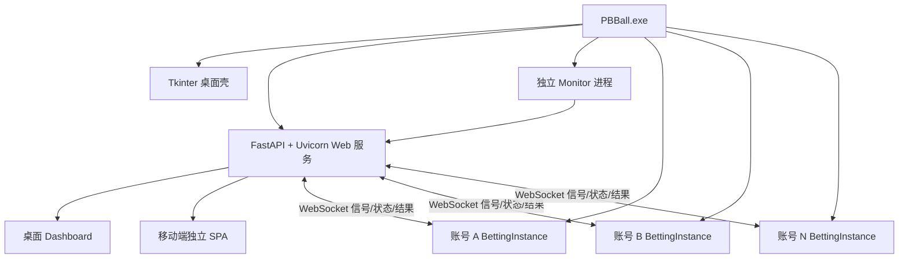
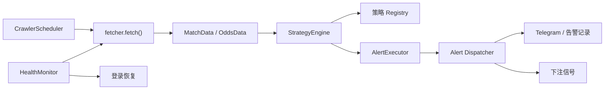
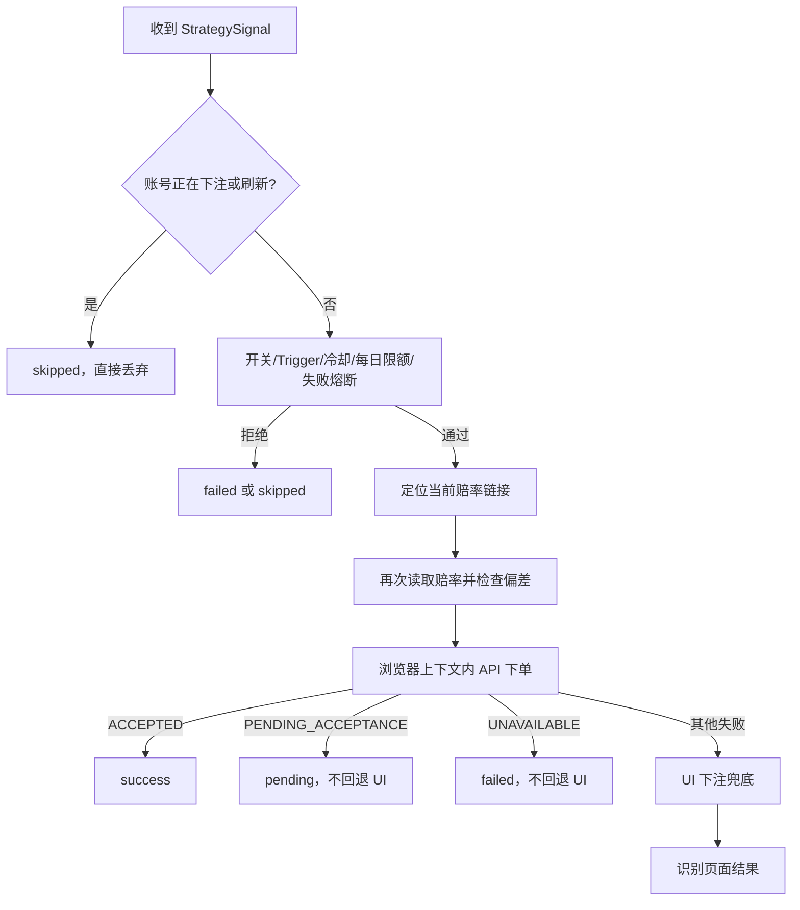

# PBBall 2 参考程序解析与皇冠差异分析

> 分析日期：2026-07-10  
> 样本：`%USERPROFILE%\Downloads\PBBall 2.zip`  
> SHA-256：`103EB4EC24A8C98FE6E2705145E32E8D5E07A7ADCCCCEB1DEE11C807B5C2B47E`

## 1. 文档目的

本文说明 PBBall 2 的产品形态、运行架构、监控和策略机制、自动下注链路、多账号模型及 Dashboard 能力，并与当前皇冠项目逐项比较。

本文只用于理解参考实现。PBBall 2 面向的是 PS3838/Pinnacle 类平台，皇冠使用另一套登录、赛事和下单协议。可以借鉴它的模块边界和运维思路，不能直接复制接口字段或下注流程。

## 2. 分析范围与安全边界

PBBall 2 不是普通源码仓库，而是 PyInstaller 打包的 Windows 产品。压缩包包含：

- `PBBall.exe`，约 91.9 MB；
- Python 3.14 runtime；
- FastAPI、Uvicorn、APScheduler、Playwright、playwright-stealth 等依赖；
- 桌面端和移动端 Web 静态资源；
- 编译后的第一方 Python 模块；
- 配置文件、策略 JSON 和浏览器内执行的下注 JavaScript；
- 实际运行留下的账号实例、Cookie 和投注历史。

本次分析采取以下边界：

- 未运行 `PBBall.exe`；
- 未连接 PS3838/Pinnacle 或任何真实投注平台；
- 未读取、展示或复制账号、Cookie、浏览器 profile、投注历史等隐私内容；
- 只解包并检查安全代码、静态资源和编译模块结构；
- 对缺失或无法从静态代码确认的部分明确标记为“未知”，不将推断写成事实。

安全分析副本位于 `output/analysis/pbball2-103eb4ec/`。该目录只用于本地研究，不应整体提交或公开分发，其中的 `PBBall.exe` 也不应作为皇冠项目依赖。

## 3. PBBall 2 的产品形态

PBBall 2 把桌面壳、Web 后台、监控进程和下注进程组合成一个本地产品：



同一个 EXE 通过不同命令行参数复用为不同角色：

- 默认模式：启动 Tkinter 桌面壳和 Web 后台；
- `--run-monitor`：运行监控进程；
- `--run-betting --instance ... --server ...`：运行某一个账号的下注实例。

这种分发方式让普通 Windows 用户容易启动，但也造成安装包庞大、运行数据容易混进发布包、升级和问题排查依赖完整 EXE 的问题。

## 4. 监控后端架构

### 4.1 已确认的主链路



主要职责分离如下：

| 模块 | 职责 |
|---|---|
| `BrowserManager` | 创建 Playwright Chromium、持久化上下文、浏览器 profile、代理、stealth 和清理 |
| `PageOps` | 导航足球/篮球页、刷新、取 HTML、关闭弹窗、滚动、点击盘口分类 |
| `CrawlerScheduler` | 定时触发抓取、防止重入、设置单轮超时、管理独立 asyncio loop |
| `MonitorOrchestrator` | 组织 fetch、标准化、策略计算、告警发送和状态统计 |
| `StrategyRegistry` | 用名称注册策略，阻止重复注册 |
| `StrategyEngine` | 加载配置、执行多个策略、隔离单个策略异常、动态重载 |
| `AlertExecutor` | 最低告警等级和冷却门控 |
| `HealthMonitor` | 登录状态、页面阻断、数据异常、网络恢复和重新登录 |
| `DataStorage` | 最新快照、历史快照、每日聚合和索引 |
| `TrendTracker` | 单场时间序列、盘口分段、变动检测和趋势概览 |

### 4.2 数据采集方式

已确认目标站是 `https://www.ps3838.com`，浏览器使用 Playwright Chromium，默认可视运行、60 秒超时、1920×1080 viewport，并加载可配置浏览器指纹和部分 stealth 脚本。

实际 `fetcher`、parser 和 login manager 的完整实现不在本次可恢复模块中，因此不能确认赛事数据究竟来自 DOM、XHR/API 拦截，还是二者混合。可以确认的是：浏览器生命周期和页面操作是核心基础设施，不能把它描述成纯 HTTP API 抓取器。

### 4.3 调度和容错

- 默认每 60 秒抓取一次；
- 启动后立即抓取一次；
- `_crawling` 防止前一轮未结束时重叠执行；
- 单轮默认 120 秒超时；
- 策略异常按策略隔离，不影响同场其他策略；
- 默认关闭滚球监控；
- HealthMonitor 默认 30 秒检查一次，连续 3 次异常才告警；
- 能识别 Cloudflare、Access Denied、Attention Required 等阻断页面并尝试重新登录。

PBBall 的不足是：告警发送前就写入 300 秒冷却。如果 dispatcher 发送失败，信号仍然被冷却，可能造成漏发。健康模块也存在一些统计方法，但从可见代码无法确认它们是否都已接线。

## 5. 策略模型

策略统一返回 `StrategySignal`，主要包含：

- `strategy_name`；
- `signal_type`；
- `alert_level`；
- `strength`；
- `message` 和 Telegram 文本；
- `metadata`；
- 一个或多个 `Trigger`。

`Trigger` 包含下注方向、金额、触发键、触发时赔率和最大允许赔率偏差。也就是说，策略负责表达“为什么触发、建议下什么”，执行器负责做统一风控和真正下注。

已发现三类策略：

| 策略 | 当前默认 | 作用 |
|---|---:|---|
| `odds_change` | 开启 | 同一主盘口下比较当前赔率与上一快照的变化 |
| `handicap_change` | 关闭 | 识别让球盘、大小盘盘口值和赔率的共同变化 |
| `odds_trend` | 关闭 | 识别单调上升/下降、先升后降、先降后升和高波动 |

默认启用的 `odds_change` 主要使用 `0.08` 的正向变化阈值，默认 Trigger 金额为 50，最大赔率偏差为 0.02。配置可以通过 Web 后台修改并热重载，不需要重启整个监控进程。

这个模型比皇冠当前把较多判断集中在 watcher 和固定监控模式中更容易扩展。但 PBBall 的执行器最终只取第一个有效 Trigger，因此同一轮多个方向同时满足时，优先级隐含在代码遍历顺序里，而不是显式业务规则。

## 6. 自动下注链路

### 6.1 端到端状态机



执行前的主要门控包括：

- 自动下注开关；
- 是否存在有效 Trigger；
- 账号实例冷却；
- 是否找到当前 odds row；
- 当日金额上限；
- 同一赛事连续硬失败熔断；
- 当前赔率与触发赔率的偏差是否超过配置值。

### 6.2 API 下单协议

下注 JavaScript 在已经登录的浏览器上下文内运行，共享 cookie 和 localStorage。其两步链路为：

1. 调用 `/member-betslip/v2/all-odds-selections` 创建/刷新 betslip；
2. 使用 betslip 返回的最新 `selectionId` 和赔率调用 `/bet-placement/buyV4`。

PBBall 使用平台提供的结构化标识：

- `oddsId`；
- `altLineId`；
- `teamType`；
- 由上述字段拼出的 `selectionId`；
- betslip 返回的新版 selectionId。

它会接受 betslip 的 `OK` 和 `ODDS_CHANGE`，提交时硬编码 `acceptBetterOdds: true`，并为请求生成随机 UUID。

### 6.3 API 和 UI 双路径

API 成功直接结束。`UNAVAILABLE` 或 `PENDING_ACCEPTANCE` 不允许 UI 回退；其他 API 失败会尝试 UI 下单，包括点击赔率、填入金额、接受更佳赔率、点击投下和读取结果。

“API 优先、UI 兜底”是有价值的容错思路，但 PBBall 没有证明 API 失败前庄家一定未接单。如果请求已经被接受、客户端只丢失响应，再用 UI 重试可能造成重复下注。皇冠不能照搬这种回退条件。

## 7. 多账号模型

每个账号拥有独立目录、进程和浏览器状态：

```text
instances/<username>/
├─ <username>.json
├─ cookies.json
├─ browser_profile/
├─ history.json
├─ state.json
└─ logs/
```

每个 BettingInstance 独立持有：

- LoginManager；
- 浏览器 page；
- BetFlow；
- BettingExecutor；
- BettingHistory；
- 下注锁和页面刷新锁；
- 余额、今日下注、冷却和累计结果状态。

账号之间可以并行，单账号内严格串行。下注实例通过 `/ws/betting` 注册，声明 username 和支持的 market filters；Web 后端按市场找到可接收信号的实例，并接收其心跳、状态和下注结果。

这个模型比皇冠当前通过 CLI 按 `betOrder` 顺序逐账号执行更适合长期运行和后台运维。但它没有持久消息队列：账号忙碌或刷新时，信号直接 `skipped`，不会排队、重放或重新校验。

## 8. 风控与账本

PBBall 已实现：

- 每赛事/策略 300 秒告警冷却；
- 账号实例级下注冷却；
- 当日成功下注金额上限；
- 同一赛事连续两次硬失败后熔断 30 分钟；
- 余额不足时自动关闭该账号下注；
- `success / pending / failed / skipped` 状态区分；
- 每账号历史和全局历史；
- 历史最多保留 500 条；
- 历史文件使用临时文件加 `os.replace` 原子替换。

已确认的风控缺口：

1. `pending` 不计入每日上限，也没有后续确认、拒绝或结算对账；
2. 没有稳定业务幂等键，随机 UUID 只用于单次请求；
3. 没有持久队列和信号重放；
4. 当日限额只统计 success，没有未确认敞口、单场/联赛/玩法限额和余额预留；
5. UI 结果通过页面通用文字识别，可能命中旧消息；
6. 正式庄家订单号可能没有被正确写入 `bet_id` 字段；
7. 冷却状态和实例状态可能互相覆盖，重启恢复不可靠；
8. 历史写入异常可能被静默吞掉。

## 9. Dashboard 和运维能力

PBBall 桌面端有 8 个主页面：下注控制台、实时监控、历史走势、策略、下注记录、告警、过滤器和系统设置。移动端是独立 bundle，不是简单把桌面页面缩窄。

主要产品能力包括：

- 首次设置向导；
- 登录页；
- watcher 启停、重启和日志；
- 单账号/全部账号启停、重启、清 session；
- CPU、内存、磁盘、余额、今日金额、冷却和心跳状态；
- 赔率趋势图、盘口快照和变盘记录；
- 策略在线配置和热重载；
- 投注和告警筛选、详情、删除、批量删除及统计；
- 数据保留周期和按类别清理；
- WebSocket 实时状态和执行结果回写；
- PID/状态文件持久化，Dashboard 重启后能重新发现已有子进程。

它的认证并不可靠：登录成功只生成前端使用的 token，业务 API 没有统一认证 middleware 或 route dependency；后端默认监听 `0.0.0.0`，直接请求 API 可以绕过登录页。皇冠当前同样没有真正 API 认证，不能因为增加一个登录页面就认为系统安全。

## 10. 两个平台的根本差异

| 维度 | PBBall 2 / PS3838 | 当前皇冠 |
|---|---|---|
| 平台协议 | 结构化 JSON REST，存在稳定 oddsId、altLineId、selectionId | 旧式 XML/form 协议，赛事有真实 GID 等字段，但 marketId/selectionId 多为本地组合键 |
| 采集方式 | 以 Playwright 浏览器为基础，具体 fetcher 实现不完整 | `transform_nl.php` 登录、`transform.php` XML 为主，DOM fallback/cross-check |
| 下单预览 | betslip 会返回刷新后的 selectionId 和当前赔率 | `FT_order_view` 返回预览、赔率、限额或错误 code，字段与玩法强相关 |
| 提交 | JSON `buyV4`，结构化 selection 和 UUID | form/XML `FT_bet`，需要准确映射 wtype、rtype、chose_team、f 等字段 |
| 订单确认 | 只依据即时返回；pending 未对账 | 已有 `get_dangerous` 轮询，但当前只做有限次数确认，仍缺完整对账状态机 |
| 监控策略 | Registry + StrategyEngine + 动态 JSON | watcher 内固定模式和监控规则，尚未抽成插件式策略引擎 |
| 多账号 | 每账号独立进程、浏览器、锁、历史，通过 WS 接收信号 | 账号配置和手工顺序执行已存在，长期独立 worker 尚未建立 |
| 数据 | latest/history/daily/index JSON + 每账号 JSON | SQLite 配置/历史 + JSON 配置 + append-only JSONL 快照/变化 |
| Dashboard | 桌面/移动双 SPA，进程控制、日志、系统资源、实时 WS | 单 React/Ant Design SPA，业务配置和监控较强，进程接管和实时执行控制较弱 |
| 分发 | 单 EXE 本机产品 | Node/Docker 项目，维护和测试更透明 |
| 安全 | 有登录 UI但 API 可绕过；样本包混入运行数据 | API 无认证；诊断接口存在敏感数据泄露风险；Docker 构建也有 secret 风险 |

最关键的差异是：PBBall 可以直接依赖庄家提供的稳定 selection 标识，而皇冠目前只能从 XML 赛事字段、本地盘口 key 和受控抓包中重建下单字段。因此皇冠的首要工作不是复制 PBBall 的下注 JavaScript，而是建立可靠的“皇冠赛事/盘口版本 → 预览 → 当前可下注选择 → 订单确认”状态模型。

## 11. 皇冠可以借鉴的部分

### 11.1 应直接借鉴的架构原则

- 把抓取、标准化、策略、信号、执行、账本和 Dashboard 明确分层；
- 策略只生成结构化信号，不直接操作庄家会话；
- 每个下注账号使用独立 worker、独立会话、独立串行锁和独立健康状态；
- 监控进程不直接导入真实下注提交器；
- 下单前重新预览并校验赔率、盘口版本和金额限制；
- 区分 success、pending、failed、skipped 和 unknown；
- 为同场硬失败、余额不足、登录失效建立自动熔断；
- Dashboard 能发现和接管重启前已有进程；
- 用 WS 或 SSE 实时推送状态、告警和结果；
- 提供按账号日志、最近心跳、余额、敞口、今日金额和冷却状态。

### 11.2 皇冠应保留的现有优势

- SQLite 保存结构化配置和投注历史；
- 账号 secret 使用本地 AES-256-GCM 加密，API 只返回 `hasSecret`；
- XML 主数据源与 DOM fallback/cross-check；
- 真实下注需要显式 `--real`、确认短语和最大金额；
- 监控候选生成与真实执行分离；
- 抓包 public/private 分离和脱敏审计；
- 默认联赛、单场追踪和多分线 `lineKey`；
- 当前 fake provider 测试和 dry-run 预览边界。

## 12. 不能照搬的部分

- 不能复制 PS3838 的 `oddsId/altLineId/selectionId` 映射到皇冠；
- 不能把 API 失败简单等价为“未下注”，随后直接 UI 重试；
- 不能让 `pending` 不占用风险额度；
- 不能在账号忙碌时直接丢弃信号而没有审计和重试策略；
- 不能用页面通用文字作为唯一订单成功依据；
- 不能把 `acceptBetterOdds` 硬编码为 true；
- 不能只做一个前端登录页而不保护 API、WS/SSE 和内部信号入口；
- 不能把账号实例、Cookie、真实历史打进发布包；
- 不能用多个 JSON 文件代替需要事务和并发控制的正式下注账本。

## 13. 皇冠当前应优先讨论的问题

在确定具体设计前，需要先明确产品第一优先级，因为下面三类改造的工作量、风险和验收方式明显不同：

1. **监控准确性优先**：先修 JSONL 批次语义、事件基线抖动、开赛时间缺失、策略解耦和趋势数据；
2. **多账号自动下注优先**：先建立账号 worker、信号队列、幂等键、敞口账本、preview/submit/reconcile 状态机；
3. **产品运维优先**：先做 API 真认证、进程接管、实时状态、日志中心、移动端信息架构和安装分发。

无论选择哪一项，以下安全问题都应视为前置修复，而不是功能优先级的一部分：

- 登录诊断不得通过 API 返回 cookies、storageState 或明文密码；
- 单账号执行必须使用所选投注账号自己的 session；
- 派生金额也必须经过 `maxStake`；
- 每日限额必须按账号聚合，并包含 pending/unknown 敞口；
- Dashboard 写 API、实时通道和内部信号必须经过真正认证；
- Docker build context 不得包含 Telegram token、账号资料或 runtime secret。

## 14. 当前结论

PBBall 2 最值得皇冠模仿的不是界面或接口，而是三个结构：

1. 可注册、可热更新的策略引擎；
2. 每账号独立的长期 Betting Worker；
3. 能管理进程、日志、心跳、余额和结果的运行控制台。

皇冠比 PBBall 2 更需要强化的部分是：协议版本映射、业务幂等、未确认订单对账、聚合风险敞口和真正的后台认证。只有这些基础稳定后，多账号自动下注才适合从当前受控 CLI 变成长期自动运行服务。
