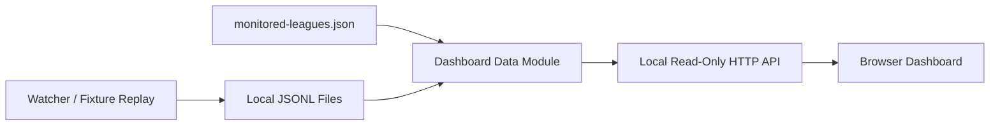

# Crown Dashboard Design

## Goal

Build a local read-only Web Dashboard for the Crown football odds monitor. The dashboard visualizes existing local monitor output so the current odds snapshots, monitored leagues, event list, odds details, and odds changes can be inspected in a browser.

## Current Context

The project already has a first-stage Crown football read-only monitor:

- Fixed fixture: `data/fixtures/crown/20260708_004011`
- Runtime snapshots: `data/runtime/crown-odds-snapshots.jsonl`
- Runtime changes: `data/runtime/crown-odds-changes.jsonl`
- League allowlist: `config/monitored-leagues.json`
- Read-only watcher: `scripts/crown-watch.mjs`
- Fixture replay: `scripts/crown-replay-fixture.mjs`

The dashboard must sit on top of those files. It must not replace the watcher, construct Crown requests, or introduce betting execution.

## Recommended Approach

Use a local Node.js HTTP server with static frontend files and read-only JSON APIs.

| Option | Decision | Reason |
|---|---|---|
| Static HTML only | Reject for now | Direct local JSONL loading is brittle in browsers and hard to extend. |
| Local Web Dashboard | Use | Reads JSONL/config reliably, keeps the app local, and avoids desktop packaging overhead. |
| Electron/Tauri desktop app | Defer | Useful later, but too heavy before the monitor data contract is stable. |

## Product Scope

### In Scope

- Start a local dashboard at `http://127.0.0.1:8787`.
- Read local JSONL snapshot and change files.
- Read `config/monitored-leagues.json`.
- Aggregate latest odds by event.
- Show monitored leagues, events, selected event odds, and recent changes.
- Show clear empty/error states when files are missing, empty, or malformed.
- Auto-refresh the browser data every 5 seconds.

### Out Of Scope

- Starting or stopping `scripts/crown-watch.mjs` from the dashboard.
- Editing `config/monitored-leagues.json` from the dashboard.
- Telegram alert configuration UI.
- SQLite storage.
- Any betting button, stake input, order creation, order preview, order submission, or betting adapter.
- Any display of cookie, token, authorization, set-cookie, or browser profile data.

## Architecture



### Backend Units

| Unit | Responsibility |
|---|---|
| JSONL reader | Read local JSONL files, skip blank lines, report parse errors without crashing the process. |
| Dashboard data module | Build summary, latest event list, recent changes, and config response objects. |
| HTTP server | Serve static files and read-only API responses. |

### Frontend Units

| Unit | Responsibility |
|---|---|
| Layout shell | Header status, filter sidebar, event list, detail panel, changes area. |
| Data client | Poll API endpoints every 5 seconds and render loading/error states. |
| Event table | Search and filter by league/mode/team. |
| Event details | Show latest markets and selections for one event. |
| Changes panel | Show recent odds changes with old/new values and direction. |

## API Contract

### `GET /api/health`

```json
{
  "ok": true,
  "app": "crown-dashboard",
  "readonly": true,
  "time": "2026-07-08T00:00:00.000Z"
}
```

### `GET /api/config`

Returns the parsed `config/monitored-leagues.json` content plus file metadata:

```json
{
  "exists": true,
  "path": "config/monitored-leagues.json",
  "updatedAt": "2026-07-08T00:00:00.000Z",
  "config": {
    "enabled": true,
    "defaultAction": "ignore",
    "include": [],
    "exclude": []
  }
}
```

### `GET /api/summary`

```json
{
  "readonly": true,
  "source": "runtime-jsonl",
  "files": {
    "snapshots": {
      "exists": true,
      "lineCount": 175,
      "parseErrors": 0,
      "updatedAt": "2026-07-08T00:00:00.000Z"
    },
    "changes": {
      "exists": true,
      "lineCount": 0,
      "parseErrors": 0,
      "updatedAt": "2026-07-08T00:00:00.000Z"
    }
  },
  "totals": {
    "events": 15,
    "leagues": 2,
    "snapshots": 175,
    "changes": 0
  },
  "lastCapturedAt": "2026-07-08T00:00:00.000Z"
}
```

### `GET /api/events`

Returns latest odds grouped by event:

```json
{
  "items": [
    {
      "eventKey": "crown|league|home|away|mode",
      "league": "League Name",
      "homeTeam": "Home",
      "awayTeam": "Away",
      "mode": "prematch",
      "status": "not_started",
      "recordCount": 12,
      "marketCount": 4,
      "selectionCount": 12,
      "lastCapturedAt": "2026-07-08T00:00:00.000Z",
      "markets": []
    }
  ]
}
```

### `GET /api/changes`

Returns recent odds changes, newest first:

```json
{
  "items": [
    {
      "capturedAt": "2026-07-08T00:00:00.000Z",
      "eventKey": "crown|league|home|away|mode",
      "league": "League Name",
      "homeTeam": "Home",
      "awayTeam": "Away",
      "marketType": "asian_handicap",
      "handicapRaw": "0/0.5",
      "side": "home",
      "oldOddsRaw": "0.86",
      "newOddsRaw": "0.88",
      "direction": "up"
    }
  ]
}
```

## UI Design

This is an operational dashboard, not a marketing page.

| Area | Content |
|---|---|
| Header | App name, read-only badge, last refresh time, source status. |
| Summary strip | Snapshot count, change count, event count, monitored league count. |
| Sidebar | League list, mode filter, team search. |
| Main table | League, matchup, mode, status, odds count, last captured time. |
| Detail panel | Selected event markets and latest selections. |
| Changes panel | Latest odds movements with old/new values and direction. |

Visual direction:

- Dense but readable.
- Neutral workbench-style layout.
- Tables and split panes over decorative cards.
- Small number of status colors: green for healthy, amber for warning, red for error, blue for selected state.
- No hero section, decorative gradient, oversized marketing copy, or gambling action UI.

## Error Handling

| Case | Behavior |
|---|---|
| JSONL file missing | API returns `exists: false`; UI shows "No runtime file yet". |
| JSONL empty | API returns zero counts; UI shows empty state. |
| Bad JSONL line | API counts parse error and continues reading valid lines. |
| Config missing | API returns `exists: false`; UI shows config unavailable. |
| API failure | UI keeps previous successful data visible and shows a compact error message. |

## Security Boundary

The dashboard is read-only:

- It only reads local files.
- It does not write runtime data.
- It does not open Crown pages.
- It does not construct Crown API requests.
- It does not click odds, open slips, fill stakes, or submit orders.
- It does not expose cookie, token, authorization, set-cookie, or browser profile data.

## Testing Strategy

| Layer | Verification |
|---|---|
| Data reader | Unit tests for valid JSONL, blank lines, missing file, bad lines. |
| Data aggregation | Unit tests for summary counts, latest event grouping, change sorting. |
| HTTP API | Unit tests for `/api/health`, `/api/summary`, `/api/events`, `/api/changes`, `/api/config`. |
| Frontend | Browser verification for layout, filtering, event selection, empty states, auto-refresh. |
| Safety | Keyword scan confirms no betting execution code. |

## Acceptance Criteria

- `npm run crown:dashboard` starts a local server at `http://127.0.0.1:8787`.
- Dashboard loads without external network access.
- Summary counts match local JSONL inputs.
- Events group snapshots by stable event key.
- Changes display newest first.
- Missing/empty/malformed files produce visible, non-crashing states.
- No betting execution UI or code is introduced.
- `npm test` and `npm run check` pass.
- Browser verification confirms the page renders correctly on desktop and narrow viewport.

## Implementation Status

Design confirmed. Implementation is not started in this document.
