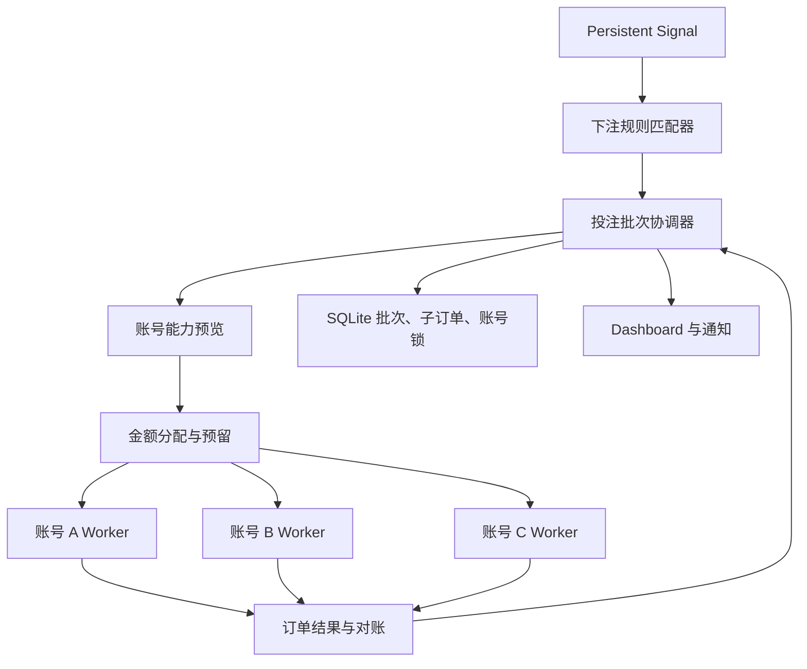

# Crown B 阶段多账号投注与监控设置改造设计

> 状态：用户已确认方案 A（B1 安全核心 → B2 Provider/Executor）  
> 日期：2026-07-10  
> 阶段：B — 多账号自动投注  
> 前置条件：A 阶段 monitor-v2、持久 Signal 和确定性 Candidate 已完成

> 规范优先级：第 17–22 节是 2026-07-10 复核后的安全补强；与前文存在差异时，以第 17–22 节为准。

## 1. 目标

B 阶段把已持久化的升水 Signal 接入可恢复的多账号投注执行链，并同步修正下注规则、账号限制、赛前/滚球监控和开赛时间展示。

系统需要稳定完成以下流程：

1. 升水报警匹配一张已启用下注规则；
2. 以规则的“一条投注上限”作为本次报警的目标总金额；
3. 并发读取每个账号的余额和当前盘口下注限额；
4. 在不超出目标金额的前提下统一分配并预留金额；
5. 多账号并发投注、单账号内部串行确认；
6. 对成功、拒绝、未知、余额不足和服务重启进行可追溯处理；
7. 总能力不足时能投多少投多少，并明确记录部分完成。

## 2. 已确认业务决策

### 2.1 下注规则

- 支持手动新增多张规则卡。
- 每张规则独立启用或关闭，多张规则可以同时生效。
- 每张规则可选择多个“今日白名单联赛”，只选择联赛名称，不选择具体比赛。
- 已启用规则之间禁止联赛重叠；保存或开启时发现冲突必须拒绝并显示冲突规则和联赛。
- 规则至少选择一个联赛才能开启；空联赛不代表全部联赛。
- 选中的联赛名称跨天保留。某天不在今日白名单或没有比赛时不触发，重新出现后自动恢复。
- “一条投注上限”表示一次报警所有账号合计最多投注多少，不是单账号额度。
- 投注方向固定为“升水反打”，不提供方向选择。
- 掉水继续监控和报警，但不创建投注批次。
- 变水后赔率上下限都可留空；留空表示不限制该边界。
- 上下限检查报警盘口升水后的新赔率，不检查反向盘口的实际下注赔率。
- 规则检查只发生在报警进入投注批次前。批次创建后，后续赔率变化或超出区间都不取消投注。

### 2.2 账号限制

- 每个账号配置一个必填的单笔投注上限。
- 不设置单账号每日投注上限，账号持续使用直到余额不足或耗尽。
- 当前余额由皇冠读取并显示，不允许手工填写为权威余额。
- 多账号可以并发；同一个账号同一时间最多存在一笔待确认投注。
- 同一账号只有收到明确投注成功或明确失败后，才能进行下一笔；结果未知时继续锁定。

### 2.3 盘口锁定

- 投注批次锁定报警时的比赛、市场、周期、盘口线和反打目标方向。
- 赔率变化允许，实际提交使用每次 `FT_order_view` 返回的当前赔率。
- 盘口线变化不允许自动追单。
- 原盘口线关闭、消失或无法预览时，该账号不投注，不自动改投新盘口线。

### 2.4 执行权威源与总闸门

- SQLite 中的持久 Signal 是创建投注批次的唯一触发源；`monitor_candidates` 与 JSONL Candidate 仅作兼容投影、诊断和旧 dry-run 输入，不得再次触发批次。
- watcher 永远保持只读，不导入、不实例化也不调用 `CrownBetAdapter`，不发送 `FT_bet`。
- 独立 Betting Executor 消费 SQLite Signal 和批次账本。系统默认 `off/dry-run`；真实自动执行必须同时通过系统 real 开关、一次明确授权、全局硬上限、规则启用、账号启用、协议能力白名单和审计检查。
- B1 只允许模拟 Provider；B2 先完成真实只读预览。真实小额提交仍需用户在验收当次单独确认。
- 旧规则迁移后默认关闭并保持 preview-only，不能因字段迁移自动获得真实执行权。

### 2.5 单账号多轮语义

- `perBetLimit` 是每一笔子订单的上限，不是账号对整个批次的累计上限。
- 同一账号可以在同一批次贡献多轮，但上一笔必须明确 `accepted` 或 `rejected` 并释放锁；`submitting`、`submit_dispatched`、`unknown` 时禁止下一轮。
- 每一轮都重新登录校验、预览余额、读取限额并验证锁定盘口，不能复用上一轮能力。

## 3. 非目标

- 不增加按具体球队或具体比赛定制的下注规则。
- 不允许多个已启用规则覆盖同一联赛后叠加金额。
- 不为账号设置每日额度。
- 不在结果未知时自动重投。
- 不因赔率变化重新生成同一报警的第二个批次。
- 不自动把原盘口替换为相邻或最新盘口线。
- 未经单独确认，不执行真实小额验收投注。

## 4. 总体架构



采用中央批次协调器，而不是各账号独立抢金额。协调器在提交前统一计算和预留，防止并发后超过一条投注上限。

系统不建立一个让所有报警串行等待的全局 FIFO 队列。多个投注批次可以同时存在，但账号锁保证一个账号同一时间只属于一笔待确认子订单。

## 5. 下注规则模型

建议的规则结构：

```text
BettingRule
├── id
├── name
├── enabled
├── executionMode: preview_only | real_eligible
├── leagueNames[]
├── currency
├── amountScale
├── targetAmountMinor
├── changedOddsMin: number | null
├── changedOddsMax: number | null
├── direction: up_reverse
├── createdAt
└── updatedAt
```

### 5.1 字段语义

| 字段 | UI 文案 | 语义 |
|---|---|---|
| `targetAmount` | 一条投注上限 | 每次匹配报警尝试完成的账号合计金额 |
| `changedOddsMin` | 变水后赔率下限 | 报警源盘口升水后的新赔率下限，含边界 |
| `changedOddsMax` | 变水后赔率上限 | 报警源盘口升水后的新赔率上限，含边界 |
| `direction` | 投注方向 | 固定为升水反打，不可编辑 |

赔率区间显示规则：

- 两边都有值：`0.80–1.05`；
- 只有下限：`≥ 0.80`；
- 只有上限：`≤ 1.05`；
- 两边都为空：`不限`。

两边都有值时必须满足下限小于或等于上限。

规则新建、复制、迁移和从关闭状态重新启用时，`executionMode` 一律写为 `preview_only`。`real_eligible` 不是普通编辑字段，只能在规则已启用后由 B2 的独立升级操作设置并写审计；关闭规则立即降回 `preview_only`，再次开启后必须重新执行独立升级。即使规则为 `real_eligible`，没有有效执行授权账本时仍不得真实提交。

每张规则必须绑定一个三位大写币种代码、`amountScale` 和该币种的 `targetAmountMinor`。只有币种与 scale 完全一致的账号能参与该规则批次；旧规则没有可靠币种时保持关闭、preview-only，等待用户复核。

### 5.2 匹配条件

一条 Signal 只有同时满足以下条件才创建批次：

1. Signal 是升水；
2. 规则已启用；
3. Signal 联赛名称包含在规则的 `leagueNames`；
4. 该联赛当前属于白名单；
5. 变水后的源盘口新赔率满足规则区间；
6. 同一 `signalId + ruleId` 尚未创建批次；
7. 反向选择可以在同一条盘口线内确定。

让球反打为同一盘口线的另一支球队，大小球反打为同一盘口线的大/小另一侧。

## 6. 账号能力与余额

建议在账号模型中保留：

```text
BettingAccount
├── id
├── label / username / loginUrl / secret
├── enabled
├── betOrder
├── perBetLimit
├── currency
├── amountScale
├── stakeStepMinor
├── balance
├── balanceUpdatedAt
├── status
└── executionStatus
```

删除账号每日限额的业务使用。旧数据库字段可在迁移期保留但必须停止参与风控和 UI 展示。

余额以投注预览时的账号响应为最终依据。账号卡片可以显示最近一次已确认余额和更新时间，但显示值不能替代下单前的重新读取。

每个账号、每个具体盘口都必须独立执行 `FT_order_view`。不能用一个账号的 `gold_gmax` 代替其他账号，因为盘口限额、账号额度和余额都可能不同。

预览至少解析：

- `gold_gmin`：当前最低下注金额；
- `gold_gmax`：当前一注最高下注金额；
- `maxcredit`：当前账号可用余额或额度；
- 当前赔率和盘口；
- 皇冠错误码和错误信息。

`maxcredit` 的真实含义必须先由脱敏真实预览证据确认；确认前只显示原始值，不把它当作可用余额参与真实执行。

账号锁表是“当前子订单”的唯一权威来源；账号表只保存派生 `executionStatus`，不再保存会与锁表冲突的 `currentChildOrderId` 双重真相。

## 7. 投注批次与子订单

### 7.1 投注批次

```text
BetBatch
├── batchId
├── signalId
├── ruleId
├── eventKey
├── lockedSelectionIdentity
├── ruleVersion / ruleSnapshot
├── sourceLeague / sourceOdds
├── currency / amountScale
├── targetAmountMinor
├── reservedAmountMinor
├── acceptedAmountMinor
├── unknownAmountMinor
├── unfilledAmountMinor
├── status
├── createdAt
└── finishedAt
```

批次状态：

- `queued`：已幂等创建，等待协调器处理；
- `allocating`：预览和分配中；
- `waiting_capacity`：账号暂时忙碌、熔断或等待退避，仍可能继续；
- `submitting`：至少一笔子订单正在提交；
- `waiting_result`：存在结果未知的子订单；
- `completed`：成功金额达到目标；
- `partial`：无 unknown、无未来能力，且 `0 < acceptedAmountMinor < targetAmountMinor`；
- `failed`：无 unknown、无未来能力，且 `acceptedAmountMinor = 0`；
- `cancelled`：人工停止未提交部分。

### 7.2 子订单

```text
BetChildOrder
├── childOrderId
├── batchId
├── accountId
├── attempt
├── requestedAmountMinor
├── previewMinStakeMinor
├── previewMaxStakeMinor
├── previewBalanceMinor
├── previewStakeStepMinor
├── previewOdds
├── providerReferenceCiphertext
├── submitAttemptId / submitPreparedAt / submitDispatchedAt
├── status
├── errorCode / errorMessage
├── submittedAt
└── resolvedAt
```

子订单状态至少包括 `previewing`、`reserved`、`submit_prepared`、`submit_dispatched`、`accepted`、`rejected`、`unknown` 和 `cancelled`。

`batchId` 由 `signalId + ruleId` 确定性生成，数据库唯一约束保证同一报警重放不会重复建立批次。

## 8. 金额分配算法

### 8.1 预览

批次创建后，对所有已启用、已配置密码、登录可用且当前空闲的账号并发预览锁定的原盘口。

所有金额先按账号的 `amountScale` 转换为整数最小单位。账号本轮能力：

```text
capacityMinor = min(
  account.perBetLimitMinor,
  preview.goldGmaxMinor,
  confirmedBalanceMinor,
  batch.remainingTargetMinor,
  executor.globalHardLimitRemainingMinor
)
```

如果币种不一致、金额无法精确转换、`capacityMinor < goldGminMinor` 或金额不满足 `stakeStepMinor`，该账号本轮不可用。不同币种账号不能进入同一批次。

### 8.2 分配与预留

按 `betOrder` 从小到大确定稳定优先级，但分配器必须联合考虑每个账号的 min/max/step，选择“不超过剩余目标且填充金额最大”的确定性组合，不能使用会留下不可下注尾数的简单贪心。金额相同时优先较小 `betOrder`，再按账号创建时间和账号 ID 排序。所有获得分配的账号可以同时提交。

例如目标 5000：

```text
账号 A 能力 4000 -> 预留 4000
账号 B 能力 2000 -> 只预留剩余 1000
```

预留必须与账号锁在同一个 SQLite 事务中完成，任何时刻满足：

```text
acceptedAmountMinor + reservedAmountMinor + unknownAmountMinor <= targetAmountMinor
```

### 8.3 后续轮次

账号明确成功或失败后释放账号锁。批次仍有剩余目标时，协调器重新读取余额和盘口限额后开始下一轮。

同一个账号的下一轮必须等待上一笔明确结束，不能在上一笔 pending 或 unknown 时继续提交。

账号只是暂时忙碌、熔断等待或存在可恢复退避时，批次进入 `waiting_capacity`。存在 unknown 时进入 `waiting_result`。只有没有 unknown 且没有未来可用能力时才进入终态，并按下方 accepted 金额区分 `partial` 与 `failed`。

终态优先级固定为：存在 unknown → `waiting_result`；accepted 达到目标且无非终态子订单 → `completed`；没有未来能力且 accepted 大于零 → `partial`；没有未来能力且 accepted 为零 → `failed`。人工取消时，有 accepted 的批次为 `partial` 且 `finishReason=manual_cancel`，没有 accepted 的批次为 `cancelled`；执行新鲜度过期采用同样金额规则并记录 `finishReason=expired`。

## 9. 赔率变化与盘口线锁定

规则区间是入场门槛，不是持续门禁：

1. 报警时使用升水后的源盘口新赔率检查区间；
2. 条件通过后创建批次并锁定盘口身份；
3. 后续赔率上涨、下跌、回到原值或超出区间都不取消；
4. 每次提交使用该账号最新预览返回的赔率；
5. 赔率变化不创建相同报警的第二个批次。

盘口线必须保持一致。比如报警锁定“主队 -0.5 的反向选择客队 +0.5”，后续只允许继续投注客队 +0.5。若只剩客队 +0.75，则视为原盘口不可用，不追新盘口。

## 10. 并发与账号锁

- 不同账号 Worker 并发执行。
- 每个账号在数据库中只有一个有效锁。
- 同一账号最多存在一个 `submitting` 或 `unknown` 子订单。
- 多个批次同时争用账号时，以批次创建时间和账号顺序进行确定性领取。
- 账号 A 不需要等待账号 B，但账号 A 必须等待自己的上一笔结果。
- 账号锁和金额预留必须持久化，不能只放在进程内存中。

账号领取必须在 `BEGIN IMMEDIATE` 事务内完成：查询按 `batch.created_at, batch_id, account.bet_order, account.created_at, account_id` 排序，使用账号锁表 `account_id PRIMARY KEY` 做唯一仲裁。锁释放后协调器重新扫描最老的 `waiting_capacity` 批次，避免新批次长期抢占账号。

## 11. 结果处理与恢复

### 11.1 明确成功

- 子订单变为 `accepted`；
- 金额从预留转入 `acceptedAmount`；
- 更新账号余额和投注历史；
- 释放账号锁；
- 批次未满时重新分配。

### 11.2 明确拒绝

- 子订单变为 `rejected`；
- 释放预留和账号锁；
- 记录皇冠错误码；
- 允许其他账号继续承担剩余金额。

### 11.3 结果未知或超时

- 子订单变为 `unknown`；
- 对应金额继续占用 `unknownAmount`；
- 账号保持锁定；
- 不自动重投，也不把该金额分配给其他账号；
- 等待订单记录对账或人工确认。

`submit_prepared` 必须在任何网络发送前持久化。只要进程可能已经发送 `FT_bet` 却没有持久化明确响应，恢复时一律转为 `unknown`；不得根据“本地没有 providerReference”推断未发送。

### 11.4 登录失效

- 尚未提交时允许重新登录并重新预览；
- 已经提交但结果未知时不得以重新登录为理由再次提交。

### 11.5 服务重启

- 从 SQLite 恢复未完成批次、子订单、金额预留和账号锁；
- `accepted` 不重放；
- `rejected` 可以继续分配；
- `unknown` 保持等待；
- 重启不能把未确认订单当作失败。

恢复必须覆盖四个崩溃点：预留后未准备提交、`submit_prepared` 后、网络发送后未落库、明确 accepted 后本地事务失败。只有能够证明网络未发送的 `reserved` 才允许取消或重新分配；`submit_prepared`/`submit_dispatched` 无明确结果时均按 unknown 对账。

### 11.6 规则关闭和人工取消

- 关闭规则只阻止新的报警创建批次；
- 已经创建的批次继续完成；
- 人工取消只能停止尚未提交的子订单；
- 已成功或结果未知的订单不能通过取消按钮撤销。

### 11.7 错误分类、重试与对账

- 登录失效且尚未发送：允许有限次数重新登录和重新预览；验证码、设备校验或账号保护进入人工处理，不绕过。
- 余额不足、低于最低额、原盘口关闭、`code=555` 且确认未发送：本轮不可重试或等待下一次能力刷新，不得转 unknown。
- 网络超时、连接中断、发送后响应丢失、provider pending：一律 unknown，保持金额和账号锁。
- 限速和短暂 Provider 故障仅在确认未发送时按指数退避重试，并设置次数上限与账号熔断。
- B2 对账使用持续 `get_dangerous` 和经过协议验证的今日注单查询；轮询有退避、截止时间和幂等更新。人工确认必须记录证据、操作者、时间和最终状态。
- Provider 明确返回 odds-changed 且明确证明订单未受理时，最多重新预览一次；盘口身份仍一致则用最新赔率重新准备一个新的 submit attempt，身份变化则 rejected。任何无法证明未受理的 odds-changed、响应丢失或第二次变化都转 unknown，不再自动提交。

## 12. 监控设置与开赛时间

### 12.1 模式模型

旧的 `handicap | live` 模型改为 `prematch | live`：

- 赛前监控固定包含赛前让球和赛前大小球；
- 滚球监控固定包含滚球让球和滚球大小球；
- 不提供让球/大小球勾选；
- 两个模式独立启停并允许同时运行；
- 删除 `runningMode` 和互斥逻辑；
- 删除左卡内部再次选择赛前/滚球的 `activePeriods`。

### 12.2 开赛时间

- list/detail 合并时，空时间不能覆盖已有有效时间；
- watcher 必须单实例运行，禁止旧、新进程同时写同一 SQLite/runtime；
- Dashboard API 输出 `startTimeRaw`、`startTimeUtc`、北京时间和时间质量；
- 页面统一显示北京时间并允许按开赛时间排序；
- 缺少开赛时间的赛前比赛 fail-closed，不生成投注；
- 数据质量区域列出具体缺失比赛，不只显示数量。

单实例保护使用 SQLite lease，包含 `ownerId`、PID、启动时间、心跳和过期时间。Dashboard 启动和手动 CLI 使用同一 lease；过期后允许原子接管，未过期时第二个 watcher fail-closed。赛前和滚球同时启用仍由同一个 watcher 进程处理。

时间字段契约固定为：`startTimeRaw: string | null`、`startTimeUtc: canonical ISO string | null`、`startTimeBeijing: YYYY-MM-DD HH:mm:ss | null`、`timeQuality: high | inferred | missing | invalid`、`timeWarnings: string[]`。排序使用 `startTimeUtc`；空值排在有值之后。

## 13. Dashboard 设计

### 13.1 下注规则页

每张规则卡显示：

- 规则名称和独立启用开关；
- 已选择联赛标签；
- 一条投注上限；
- 变水后赔率区间；
- 固定方向“升水反打”；
- 今日匹配比赛数量；
- 运行状态或冲突原因。

页面下方增加“最近投注批次”，显示目标金额、成功金额、结果未知金额、未完成金额和状态，不增加新的侧边栏页面。

### 13.2 投注账号页

账号卡显示：

- 投注顺序；
- 单笔投注上限；
- 当前余额和更新时间；
- 空闲、预览中、投注中、等待确认、异常；
- 今日成功次数和金额。

展开账号卡查看子订单、皇冠限额、实际赔率和失败原因。删除每日投注上限展示。

### 13.3 监控设置页

- 顶部只保留一条数据采集状态栏；
- 使用“赛前监控”和“滚球监控”两个配置区或 Tab；
- 每个模式只有一个启用开关；
- 固定显示“监控盘口：让球 + 大小球”；
- ISO 时间转换为北京时间；
- 技术健康信息放入折叠的“数据质量与诊断”。

## 14. 数据迁移

- 旧 `per_account_bet_amount` 迁移为规则 `target_amount`，但不再解释为单账号金额；
- 旧 `per_account_daily_limit` 和账号 `daily_limit` 停止参与执行；
- 投注账号新增 `per_bet_limit`、余额及状态字段；
- 下注规则新增联赛名称集合、变水后赔率上下限和启用冲突校验；
- 旧 `min_odds/max_odds` 检查目标盘口、旧 `bet_direction_mode` 语义不一致，不能无歧义迁移；旧规则保留记录但默认关闭、preview-only，并提示复核。只有用户重新保存的新规则才使用固定 `up_reverse` 和源盘口赔率区间；
- 旧监控配置按下表迁移；缺失、非法或同一目标字段出现冲突时，该模式关闭并提示复核：

| 新模式字段 | 旧字段来源 |
|---|---|
| `prematch.enabled` | `handicap.enabled && handicap.activePeriods` 包含 `prematch` |
| `prematch.minOdds/maxOdds/waterMoveThreshold/waterMoveDirection/cooldownSeconds` | 旧 `handicap` 同名字段 |
| `prematch.startMinutesBeforeKickoff/stopMinutesBeforeKickoff` | `handicap.prematchStartMinutesBeforeKickoff/prematchStopMinutesBeforeKickoff` |
| `prematch.remark/lastAlertAt` | 旧 `handicap` 同名字段 |
| `live.enabled` | `(handicap.enabled && handicap.activePeriods` 包含 `live`) || live.enabled`；两来源参数不一致则关闭复核 |
| `live.minOdds/maxOdds/waterMoveThreshold/waterMoveDirection/cooldownSeconds` | 优先旧 `live`；若 live 卡缺失且 handicap 明确包含 live，取旧 `handicap` |
| `live.liveMinuteFrom/liveMinuteTo/includeFirstHalf/includeSecondHalf/includeHalfTime` | 旧 `live` 同名字段；缺失使用当前已发布默认值 10、75、true、true、false |
| `live.remark/lastAlertAt` | 优先旧 `live`，仅 handicap 提供 live 时取旧 `handicap` |

旧 `runningMode` 和“因另一个模式启动而关闭”的 `stoppedReason` 不迁移为互斥语义。迁移结果由 version 2 配置保存，重复读取必须幂等。
- 旧启动 API 可短期接受 `handicap` 别名，新响应只返回 `prematch/live`；
- 新增批次、子订单和账号锁表，旧投注历史保留只读兼容。

迁移不得删除旧记录。无法无歧义迁移的旧规则默认关闭并提示用户复核。

## 15. 测试与验收

### 15.1 自动化测试

- 多规则、多联赛、空联赛和启用规则重叠校验；
- 变水后赔率上下限及空值语义；
- 掉水只报警、升水反打；
- 同一报警幂等创建一个批次；
- 赔率变化继续、盘口线变化停止；
- 多账号并发和单账号串行；
- 分配与预留总额不超过目标；
- `gold_gmin`、`gold_gmax`、余额和账号单笔限制共同生效；
- 明确失败后重新分配；
- unknown 不重投、不释放；
- 服务重启恢复且不重复投注；
- 开赛时间非空合并、API输出和北京时间显示；
- watcher 单实例保护。
- 整数金额覆盖 NaN、Infinity、零/负数、币种不一致、精度、step、最低额组合重排和不可下注尾数；
- 并发 API 保存规则时联赛冲突仍由数据库唯一约束原子拒绝；
- 故障注入覆盖所有 submit 崩溃点，重启后不得重复调用 `FT_bet`；
- Candidate 新鲜度、赛事阶段、开赛边界、suspended 和协议能力白名单均 fail-closed；
- 账号/规则在 reserved、submit_prepared、submit_dispatched、unknown 状态下的编辑、禁用、删除语义；
- watcher 与 Executor 持久 lease 的孤儿进程、过期和接管；
- API、UI、审计和日志敏感字段扫描。

### 15.2 真实环境验收顺序

1. 模拟提交：验证多账号并发、精确金额预留、失败、unknown、所有崩溃点和重启恢复；
2. 真实只读预览：逐账号读取余额或额度原始字段、`gold_gmin`、`gold_gmax`、step、币种和当前赔率，不发送 `FT_bet`；
3. 浏览器验收：规则卡、账号卡、投注批次、监控设置和开赛时间；
4. 只有取得单独确认后，才用极小金额执行一次真实投注验收。

### 15.3 完成标准

- 同一报警不会重复或超额投注；
- 不同账号可以同时执行；
- 同一账号上一笔未明确结束时不能继续；
- 赔率变化不取消已创建批次；
- 盘口线变化不追新盘口；
- 总能力不足时正确部分完成；
- 结果未知时不自动重投；
- 重启后状态可恢复；
- 所有金额和结果都能追溯到 Signal、规则、账号、预览和皇冠响应；
- 赛前/滚球模型、开赛时间和 Dashboard 显示符合已确认语义。

## 16. 实施边界

采用方案 A，拆成连续验收的 B1 与 B2：

- **B1 安全核心**：规则/账号新契约、整数金额、SQLite 批次/子订单/账号锁、Signal 匹配、严格盘口锁定、min/max/step 分配、模拟 Provider、unknown/崩溃恢复、规则/账号/批次 Dashboard、赛前/滚球双开、开赛时间和 watcher 单实例。B1 不访问真实 Crown，不发送 `FT_bet`。
- **B2 Provider/Executor**：协议能力矩阵、逐账号独立 session、真实只读预览、最新预览盘口核验、提交前持久 attempt、真实执行总闸门、unknown 对账、通知、安全整改和完整验收。B2 开发可以完成到真实提交门禁，但真实小额 `FT_bet` 仍需用户在验收当次单独确认。

任何真实投注、生产部署、账号密钥变更或线上数据操作都不因本设计自动获得授权，仍需单独确认。

## 17. 协议能力白名单

真实 Executor 使用版本化的 `mode × period × marketType × lineVariant` 能力矩阵。每项能力必须有脱敏 `FT_order_view`、字段映射和响应 fixture 证据；提交能力还必须有 accepted/rejected/pending/odds-changed 证据。未验证组合、赛前映射、alternate line 或 Provider 字段变化一律 blocked，不以“字段相似”推断可执行。

每次 `FT_order_view` 后必须核验 provider、event、period、market、lineKey/handicap、side 与批次锁定身份完全一致。赔率变化允许并使用预览最新赔率；盘口线、赛事阶段或选择变化立即停止该账号本轮。

## 18. 新鲜度与赛事阶段

- 批次保存 Signal 的 `observedAt`、源联赛、源赔率、周期、市场和规则快照。
- 新批次创建前检查 Signal/Candidate 新鲜度、赛事阶段、赛前是否已开赛、滚球分钟、盘口 suspended 和开赛时间质量。
- 批次创建后赔率越界不取消，但长期等待不能无限执行：超过执行新鲜度、赛前已开赛或阶段变化时，取消尚未发送部分；accepted/unknown 保持原状态。

## 19. 运行中 CRUD

- 规则修改和关闭只影响新批次；批次始终使用创建时的规则版本与快照。
- 账号被锁定时，label/notes 可修改；用户名、凭据、网址、币种、精度、step、单笔上限和执行顺序禁止修改。
- 禁用账号阻止新锁，不中断已预留或已发送子订单。存在非终态子订单或历史引用时禁止物理删除，只允许归档。
- 启用规则联赛占用写入独立映射表，以 `league_name` 唯一约束在同一事务内原子拒绝并发重叠。

## 20. 金额与账本

- 金额持久化为整数最小单位 `INTEGER`，并与 `currency`、`amountScale` 一起解释；API 使用十进制字符串，禁止二进制浮点参与账本计算。
- 所有输入拒绝 NaN、Infinity、零、负数和超出 SQLite 安全整数范围的值。
- `target/reserved/accepted/unknown/unfilled` 由子订单账本事务计算；批次聚合列是事务内维护的缓存，每次恢复都能从子订单重新核对。
- 账号币种未知、不同币种、step 未确认或 `maxcredit` 语义未确认时，真实执行 fail-closed。

## 21. B2 真实执行前置安全门禁

以下项目全部通过前，Executor 只能 dry-run/preview：

1. 登录诊断和 API 不返回 cookie、storageState、明文密码或输入快照；
2. Dashboard 写接口具备认证以及 Host、Origin、CSRF 防护；
3. Docker build context 排除 Telegram 配置、SQLite、密钥、session 和 runtime；
4. 每个 Worker 只使用对应投注账号自己的凭据和 session，禁止回退 `mon_primary`；
5. intent、规则目标、账号上限、Provider 限额、余额和全局硬上限在预留与提交前都重新比较；
6. providerReference/ticket 加密或隔离保存，API/UI/审计只返回掩码；
7. real mode、一次授权、全局硬上限、协议能力、审计和 Executor lease 缺一不可。

watcher 与 Executor 共用 `runtime_leases` 事务模型，但使用不同唯一 lease key：`watcher:<resolved-db>:<resolved-runtime>` 与 `betting-executor:<resolved-db>`。Executor 未取得 lease 时不得预览、预留或提交；过期接管前先执行批次恢复和 unknown 审计。

lease 字段固定为 `leaseKey`、随机 `ownerId`、PID、`acquiredAt`、`heartbeatAt`、`expiresAt` 和单调递增 `fencingToken`。心跳只能用 `leaseKey + ownerId + fencingToken` CAS 更新；所有 Executor 写事务都携带当前 fencing token。接管使用 `BEGIN IMMEDIATE` 原子确认过期并递增 token；旧 owner 即使恢复也因 token 过期无法预留、准备或完成子订单，从而避免 split-brain。

### 21.1 执行授权与跨批次预算

真实授权保存为 `ExecutionAuthorization`：`authorizationId`、`mode=real`、`currency`、`amountScale`、允许的 `ruleIds`、`maxTotalAmountMinor`、`reservedAmountMinor`、`acceptedAmountMinor`、`unknownAmountMinor`、`validFrom`、`expiresAt`、`status=active|revoked|exhausted|expired`、确认摘要和审计时间。授权默认不存在；最长有效期 24 小时，CLI/UI 默认 15 分钟。

一次授权表示一个可撤销、可耗尽且重启后仍有效的累计真实预算，不是每个批次重新获得额度。系统同一时间最多允许一个 `active` 授权，由数据库唯一 active-slot 约束在创建事务中原子保证。

真实执行只支持环境中明确配置的一组 `CROWN_REAL_CURRENCY`、`CROWN_REAL_AMOUNT_SCALE` 和 `CROWN_REAL_MAX_TOTAL_MINOR`；授权与规则、账号的币种和 scale 必须全部一致。修改任一环境配置后，旧 active 授权自动失效，必须重新授权。授权上限不得超过系统硬上限。批次必须绑定 active 授权，且 ruleId 必须在授权范围内。

授权预算与批次金额在同一个 `BEGIN IMMEDIATE` 事务内预留，跨所有绑定批次始终满足：

```text
authorization.acceptedAmountMinor
  + authorization.reservedAmountMinor
  + authorization.unknownAmountMinor
  <= authorization.maxTotalAmountMinor
  <= CROWN_REAL_MAX_TOTAL_MINOR
```

授权过期或撤销后禁止新预览、预留和 submit attempt；已发送及 unknown 继续对账，未发送预留安全取消。确认原文不持久化，只保存不可逆摘要和授权作用域。规则从 `preview_only` 转为 `real_eligible` 与创建授权是两个独立审计操作，缺一不可。

## 22. 通知与成功口径

- 只有 `accepted` 才计入今日成功次数/金额并发送成功通知；“今日”固定为 `Asia/Shanghai`。
- preview、`submit_prepared`、仅发送 `FT_bet` 或 pending 不得通知成功。
- unknown、partial、failed 和账号熔断发送独立告警；通知按 `batchId + childOrderId + finalStatus` 幂等。
- API、UI、通知和审计不得包含 cookie、uid、token、password、storageState、完整 ticket 或 providerReference。
