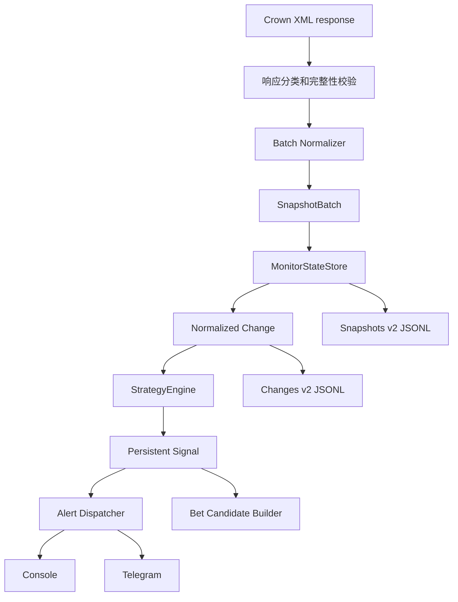

# Crown 监控核心重建设计

> 状态：待用户确认  
> 日期：2026-07-10  
> 阶段：A — 监控准确性  
> 关联分析：`docs/crown-current-architecture.md`

## 1. 目标

重建皇冠赔率监控的事实状态、批次语义、赛事身份、时间解析和策略信号链，使系统能够稳定回答：

1. 当前哪些赛事真实存在；
2. 同一赛事的 list 和 game-more 是否为同一个对象；
3. 某条盘口相对上一次有效观测发生了什么变化；
4. 该变化是否满足某一条明确策略；
5. 同一策略信号是否已经生成、告警或进入投注候选；
6. watcher 重启、网络失败或消息发送失败后，状态是否仍然可解释和可恢复。

本阶段不接入真实自动下注。真实投注仍由独立执行模块承担，watcher 只生成结构化 Signal 和候选。

## 2. 已确认问题

### 2.1 批次语义错误

当前 `JsonlOddsStore.ingest(records)` 把每次输入都视为完整赛事全集。实际 direct API 的顺序是一次 `get_game_list`，随后逐场调用多个 `get_game_more`。因此每个详情响应都会删除其他赛事和 selection baseline。

当前运行数据中：

- `event-added`：27,340；
- `event-removed`：28,146；
- 二者合计占全部变化记录 65.8%；
- 与 `get_game_more` 关联的 added/removed 超过 24,000 条；
- 与 `get_game_more` 关联的 odds-change 和 handicap-change 均为 0。

### 2.2 身份语义错误

当前 eventKey 同时包含 `gid/gidm/hgid/ecid/lid`。真实数据里 list 常有 ECID，而 game-more 可能缺 ECID。已抽查同时出现于两类响应的 18 个 eventId，18 个 eventKey 全部不一致。

### 2.3 重启恢复错误

当前启动只读取 snapshots JSONL 尾部并把其中出现过的赛事都当成 active。现有约 1.53GB 快照尾部恢复出 118 场，而最新权威 list 只有 63 场，下一轮会再次制造约 55 条虚假 removed。

### 2.4 时间门禁错误

- XML 已包含 `GAME_DATE_TIME`，normalizer 却始终写 `startTimeUtc: null`；
- 真实 `startTimeRaw` 同时存在 `2026-07-09 16:10:00` 和 `07-09 02:00p`；
- 缺少 startTimeUtc 时赛前门禁当前是 fail-open；
- Crown 滚球时间使用 `1H^08:00`、`2H^52:41`，现有通用数字提取会误读为第 1、2 分钟。

### 2.5 策略语义重复

存储层 `evaluateChangeCandidate()` 只按相邻赔率差标 candidate；watcher 的 `evaluateMonitorChange()` 又执行联赛、模式、时间、赔率范围、方向和冷却判断。因此 changes JSONL 中的 `candidate=true` 不代表系统实际报警或生成投注候选。

### 2.6 副作用耦合

`notifyChanges()` 同时承担规则判断、冷却、候选生成、配置回写、Console 和 Telegram。Telegram 网络慢会阻塞采集；发送失败前冷却已写入内存；重启后冷却丢失；随机 candidateId 无法幂等重放。

## 3. 设计原则

1. 事实状态不读取业务策略配置。
2. full list 和单场 detail 使用不同完整性语义。
3. 赛事存在性与盘口 baseline 分开维护。
4. 配置过滤不能反向改变 provider 赛事生命周期。
5. 缺少策略必需数据时 fail-closed，但仍保存原始事实供 Dashboard 查看。
6. Signal 必须可解释、可重放、可去重。
7. 策略判断、信号持久化和渠道投递分离。
8. watcher 不导入、不调用真实下注 adapter。
9. 旧污染数据不删除、不覆盖，新链路使用独立 schema/version。
10. 首次有效快照只建立 baseline，不产生变化信号。

## 4. 总体架构



## 5. SnapshotBatch

所有标准化响应先转换为批次信封：

```text
SnapshotBatch
├── schemaVersion: 2
├── batchId
├── pollId
├── capturedAt
├── provider: crown
├── sport: football
├── endpointKind
├── scopeKey
├── completeness: authoritative | partial
├── complete: boolean
├── classification
├── eventRefs[]
└── oddsRecords[]
```

### 5.1 authoritative

只有通过以下检查的 `get_game_list` 才能成为 authoritative：

- 存在完整 `serverresponse`；
- XML 结构未截断；
- 没有登录页或登录失效特征；
- eventRefs 数量与可解析的 game 节点一致；
- scopeKey 可以确定。

authoritative 批次可以更新同 scope 的 active event set。为防止庄家瞬时空列表或部分返回，赛事连续两次在完整 authoritative 批次缺失后才转为 removed。

### 5.2 partial

`get_game_more` 永远是 partial：

- 只允许 upsert 当前赛事及 selection baseline；
- 不得删除其他赛事；
- 不得替换 scope 的 active event set；
- 响应失败只记录 detail failure，不影响 list 状态。

### 5.3 scopeKey

scopeKey 至少包含：

- provider；
- sport；
- list 查询类型；
- showtype/mode；
- 日期范围；
- rtype/filter 等会改变结果集合的参数。

不同 scope 之间不得互相判定 event removed。

### 5.4 eventRefs

eventRefs 从所有 `<game>` 节点生成，不依赖是否解析出让球或大小球赔率。没有目标盘口的赛事仍然可以处于 active 状态。

## 6. 身份模型

### 6.1 赛事组和事件

第一版采用：

```text
matchGroupKey = crown|football|gidm=<GIDM>|lid=<LID>
eventKey      = crown|football|gid=<GID>
```

原因：

- 同一 GID 已验证能连接 list 和 game-more；
- ECID 在 game-more 中可能缺失，不能参与 canonical key；
- 同一 GIDM 可能存在多个 GID，不能直接全部压成一个可下注 event；
- GIDM/LID 用于 Dashboard 比赛聚合，GID 用于事件和下单映射。

`GIDM/HGID/ECID/LID/eventId` 全部保留在 `providerIds`，并维护 alias，不能因某个非主字段缺失而生成新事件。

如果 GID 缺失，只能生成低置信度 fallback key；低置信度事件可以展示和记录，但不得生成可下注 Signal。

### 6.2 盘口和选择

```text
marketIdentity = eventKey + period + marketType + lineKey
selectionIdentity = marketIdentity + side
```

handicap 值不进入 selectionIdentity，以便同一条盘口线从 `0/0.5` 变到 `0.5` 时产生 handicap-change，而不是变成全新 selection。

provider request IDs、ratioField、oddsField 和当前 handicap 仍保存在快照中，供下单预览重新映射。

## 7. MonitorStateStore

JSONL 继续作为追加审计日志，不再承担 active state 和重启恢复。结构化当前状态使用 SQLite。

建议新增：

| 表 | 作用 |
|---|---|
| `monitor_scope_state` | 保存每个 scope 最后权威批次、完整时间和当前事件集合 |
| `monitor_event_state` | 保存 canonical event、match group、provider IDs、active/missing 计数 |
| `monitor_selection_state` | 保存每条 selection 最新有效 baseline |
| `monitor_signals` | 保存确定性 Signal、策略版本、状态和 payload |
| `monitor_cooldowns` | 保存 strategyId + selectionIdentity 的冷却截止时间 |
| `monitor_deliveries` | 保存每个 Signal 向每个渠道的投递状态和重试次数 |

状态更新必须在单个事务内完成：

1. 检查批次是否晚于当前状态；
2. upsert event 和 selection；
3. 计算 Change；
4. 更新 scope/checkpoint；
5. 提交事务；
6. 事务提交后才把 Change 交给 StrategyEngine。

旧响应晚到时记录 `stale_batch`，不得覆盖新 baseline。

## 8. 时间模型

新增独立 Crown 时间解析器，输出：

```text
startTimeRaw
startTimeUtc
startTimeLocal
timeZone
timeSource
timeConfidence
timeWarnings[]
```

### 8.1 开赛时间

解析顺序：

1. `GAME_DATE_TIME`：按皇冠当前展示时区 `Asia/Shanghai` 解析；
2. `DATETIME`：解析 `MM-DD hh:mma`，年份取 capturedAt 在上海时区的年份；
3. 遇到跨年边界时，在前一年、当年、下一年中选择距离 capturedAt 最近且处于合理赛事窗口的日期；
4. 无法可靠解析时 `startTimeUtc=null` 并增加 warning。

赛前策略要求 startTimeUtc。缺失时返回 `data_incomplete:start_time_missing`，不得绕过开赛窗口。

### 8.2 滚球时间

解析 `RETIMESET`：

- `1H^08:00` → period=`first_half`，elapsedMinute=8；
- `2H^52:41` → period=`second_half`，elapsedMinute=52；
- 中场标记 → phase=`half_time`；
- 2H 但分钟小于 45 等矛盾值 → elapsedMinute=null，warning=`ambiguous_live_clock`；
- 无法解析时保留 raw，不生成需要分钟门禁的 Signal。

## 9. Change

StateStore 只生成事实 Change，不读取 monitor settings，也不写 `candidate=true/false`。

Change 类型：

- `event-added`；
- `event-removed`；
- `odds-change`；
- `handicap-change`；
- `market-suspended`；
- `market-reopened`。

所有 Change 必须包含：

- schemaVersion；
- changeId；
- batchId/pollId/scopeKey；
- observedAt；
- canonical identities；
- current source；
- old/next evidence；
- confidence 和 warnings。

event-removed 的 observedAt/source 必须来自确认移除的当前 authoritative 批次，不能复制上一快照时间。

## 10. StrategyEngine

第一版只实现 `odds_delta`，但接口允许以后增加 `handicap_move` 和 `odds_trend`。

```text
evaluate(change, context)
  -> matched=false + skipReason
  -> matched=true + Signal
```

策略规则最小结构：

```text
id
type
version
enabled
scope.modes
scope.markets
scope.periods
scope.leagues
conditions.minDelta
conditions.direction
conditions.oddsRange
conditions.kickoffWindow
conditions.liveWindow
cooldownSeconds
bettingRuleId
```

明确规则：

- `odds_delta` 只接受 `odds-change`；
- `handicap-change` 不得被隐式当成水位变化；
- suspended/reopened 由独立策略处理，第一版只记录不下注；
- 手工追踪赛事可绕过默认联赛白名单，保留当前行为；
- 缺少时间、clock、赔率或 identity 时 fail-closed；
- 冷却 key 为 `strategyId + selectionIdentity`；
- 多策略之间不共享冷却。

## 11. Signal 和幂等

Signal 至少包含：

```text
signalId
signalKey
strategyId
strategyVersion
observedAt
expiresAt
trigger
target
evidence
bettingRuleId
dataQuality
```

`signalId` 使用以下稳定内容生成 SHA-256：

- strategyId/version；
- selectionIdentity；
- changeId；
- 触发方向和阈值。

同一 Change 重放不会生成第二条 Signal。Signal 持久化成功后写入策略冷却；Telegram 是否发送成功不改变 Signal 是否存在。

## 12. Dispatcher 和候选

Dispatcher 只消费已持久化 Signal：

- Console、Telegram 各自记录 delivery 状态；
- Telegram 失败按有限次数退避重试；
- 网络等待不得阻塞下一轮 XML 采集；
- 重启后恢复 pending delivery；
- 配置永久错误进入 dead-letter，并在 Dashboard 显示。

投注候选也消费 Signal，不再消费 raw Change。candidateId 由 `signalId + bettingRuleId` 确定性生成，同一 Signal 重放不会写重复候选。

候选仍只是数据，不调用 `CrownBetAdapter`。

## 13. 配置迁移

当前 `monitor-settings.json` 的 handicap/live 配置继续兼容读取，并转换为内置 `odds_delta` 规则。

第一阶段不要求立即重做 Dashboard 策略编辑页面。新的 StrategyEngine 先支持多策略，旧 UI 仍可只控制现有两张配置卡。C 阶段再提供完整多策略管理界面。

SQLite 中未被 watcher 使用的 `monitor_rules` 不再保持“已保存但不生效”的状态：A 阶段要么完成接线和迁移，要么从当前 UI/API 明确标记为未启用，不能继续误导使用者。

下注规则必须由 `bettingRuleId` 显式绑定，禁止继续默认选择第一条 enabled betting rule。

## 14. 数据迁移和兼容

- 现有 `crown-odds-snapshots.jsonl`、`crown-odds-changes.jsonl` 保留不动；
- 新链路写入 schema v2 文件；
- 第一次 authoritative list 初始化 active state；
- 第一次 detail/selection 快照只建立 baseline；
- 第二次有效快照开始产生 Change；
- 不从旧 JSONL 尾部恢复 active state；
- Dashboard 优先读取 v2，必要时提供“旧历史数据”只读入口；
- 回滚时可以切回旧 watcher 文件路径，不需要删除 v2 数据。

## 15. 验收标准

### 批次和身份

- list A+B 后处理 detail A、detail B，active 仍为 A+B；
- partial batch 永不生成其他赛事的 removed；
- list 有 ECID、detail 无 ECID时仍为同一 eventKey；
- 同一 GIDM 的多个 GID 不发生 market/selection 冲突；
- detail 连续变化可以产生 odds-change；
- 不同 scope 不互相删除；
- 空响应、登录失效、解析错误、不完整 XML 不批量删除；
- 连续两次完整 authoritative 缺失才生成 removed；
- 重启后 active state 与最后 SQLite checkpoint 一致；
- event-removed 使用当前确认批次时间和来源。

### 时间

- 完整 `GAME_DATE_TIME` 正确转换 UTC；
- 无年份 12 小时制 DATETIME 正确补年；
- 跨年选择最近合理日期；
- `1H^08:00` 解析为 8；
- `2H^52:41` 解析为 52；
- 缺少赛前时间或滚球分钟时保存事实但不产生策略 Signal。

### 策略、Signal 和投递

- store 不读取策略配置；
- unsupported Change 不触发 odds_delta；
- 多策略冷却互不干扰；
- 冷却可跨进程重启恢复并清理过期项；
- 同一变化重放不重复 Signal；
- Telegram 失败可以重试，不重复候选；
- 慢 Telegram 不阻塞采集；
- strategyId 明确绑定 bettingRuleId；
- watcher 中不存在真实提交调用。

### 回归

- 现有 fixture、Dashboard、候选 dry-run 和 betting adapter 测试保持通过；
- 新增 list → 多个 game-more 的真实顺序 fixture 测试；
- 新增重启恢复、乱序响应、高告警量和渠道失败测试；
- 真实短跑验证没有新增敏感日志或真实下注请求。

## 16. 实施边界

本设计确认后才进入代码实施。A 阶段完成的定义是：

1. 新事实状态和时间模型投入默认 watcher；
2. 旧污染链路不再作为默认数据源；
3. StrategyEngine 和持久 Signal 实际接线；
4. Dashboard 能读取新状态和明确显示数据不完整原因；
5. 单元、fixture、回归和受控实时短跑全部通过；
6. 项目文档和 project memory 同步更新。

本阶段不把真实自动下注接进 watcher，不实现 B 阶段的账号 Worker、订单队列或订单对账。

